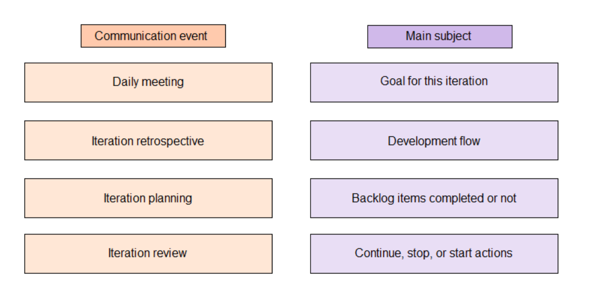
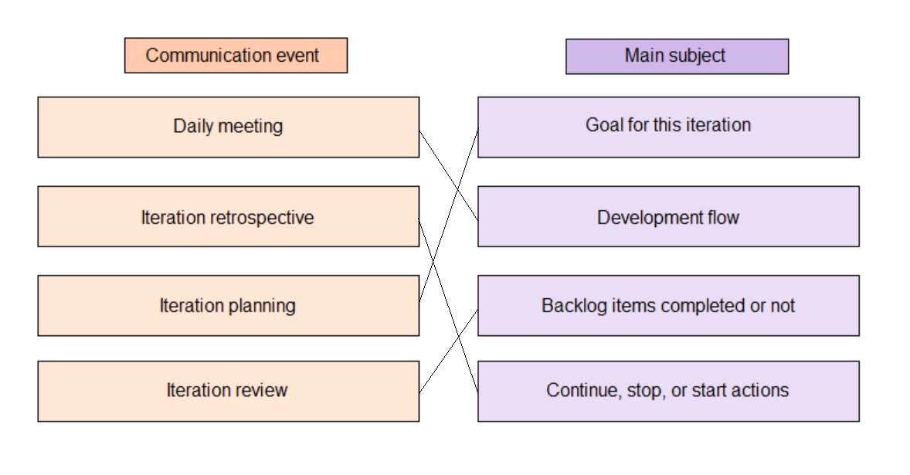
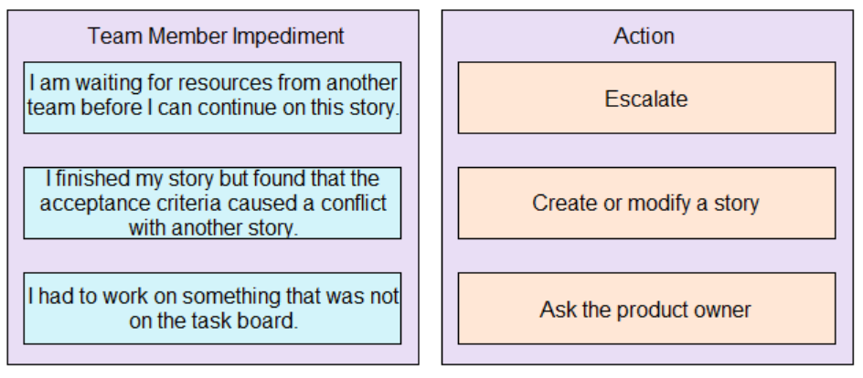
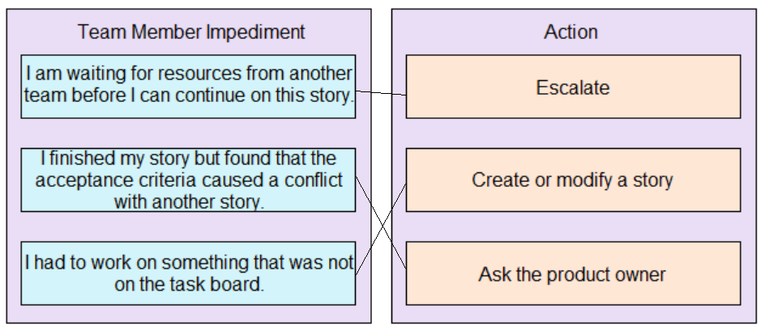
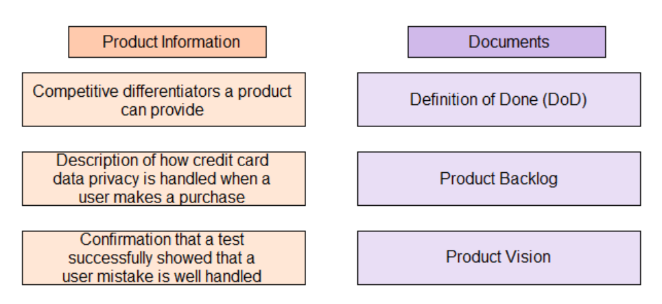
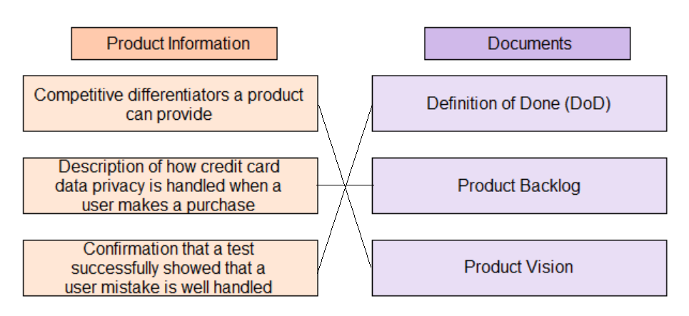
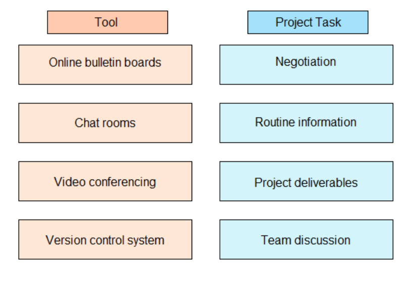
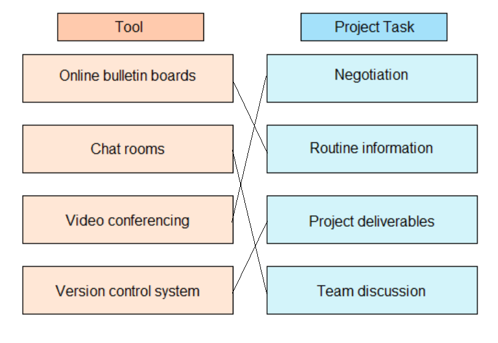

# 第一套

1. [单选] 项目发起人已要求项目经理修改项目管理计划，以便在进度计划之前完成项目。该项目没有额外预算。项目经理应该如何修改项目管理计划才能确定能否提早交付项目？The project sponsor has asked the project manager to modify the project management plan in order to complete the project before the schedule. There is no additional budget for this project. How should the project manager modify the project management plan to determine whether the project can be delivered early?
   - [ ] A：计算实耗时间与实际时间 Calculate elapsed time and actual time
   - [ ] B：包含负浮动时间分析 Contain a negative floating time analysis
   - [ ] C：包含关键路径 Contain critical paths
   - [ ] D：尽可能赶工加快项目进度计划 Work as quickly as possible to speed up the project schedule

   

      
Answer

      PMBOK（6）P222-6.6控制进度。“确定能否提早交付项目”，项目的进度由关键路径决定，所以要将修改后的项目管理计划与关键路径比对，判断是否可以提前交付项目。比对完成以后，根据相关方的期望，对项目进度进行规划，选项BD在选项C之后。

   

2. [单选] 项目经理正在估算其组织之前未从事过的一类项目的成本.应该使用什么方法来估算成本？The project manager is estimating the cost of a type of project that his organization has not undertaken before. What method should be used to estimate the cost?
   - [ ] A：参数估算 Parametric estimating
   - [ ] B：自下而上估算 Bottom-up estimating
   - [ ] C：自上而下估算 Top-down estimating
   - [ ] D：三点估算 Three-point estimating

   

      
Answer

      PMBOK（6）P202，6.4.2.5-自下而上估算。“从未从事过的一类项目”，没有可以用以参照的项目，排除参数估算和类比估算。选项D，三点估算在估算的过程中兼顾风险因素，情景中没有强调类似的场景，排除。

   

3. [单选] 一个项目实施团队需要满足一份非常严格的进度计划。相对于已完成的事项，这样会导致正在进行的工作超过负荷。为了解决这个问题，项目经理需要获得额外的资源。项目经理应该向发起人提供什么理由来支持追加资源的请求？A project implementation team needs to meet a very strict schedule. Compared with the completed items, this will cause the ongoing work to overload. In order to solve this issue, the project manager needs to obtain additional resources. What reasons should the project manager provide to the sponsor to support the request for additional resources?
   - [ ] A：防止整个项目延迟交付 Prevent delays in project delivery
   - [ ] B：提高团队生产力 Improve the team's productivity
   - [ ] C：在实施过程中推动资源平衡优化 Promote Resource leveling optimization during implementation
   - [ ] D：帮助提高团队士气 Help improve team morale

   

      
Answer

      PMBOK（6）P222-6.6控制进度。“一份非常严格进度计划”，说明项目相关方对进度比较关注，比较容易从进度的角度来说服发起人追加资源。选项BC，都是通过对资源管理来提升效率，获得高产出，然而当前团队的工作已经超负荷，排除。选项C，资源平衡会带来关键路径延长，影响工期，与情景不符，排除。

   

4. [单选] 在进行绩效评审后，项目经理识别到关键路径上五个工作包的其中一个可能会延迟两周时间。若要确保项目按进度执行，项目经理应该做什么？ In conducting the report, the project manager identified one of the five work packages on the critical path that could be delayed by two weeks. What should the project manager do to ensure that the project is on schedule?
   - [ ] A：通知相关方，并请求更多时间来处理该工作包 Notify the stakeholders and request more time to process the work package
   - [ ] B：请求额外的资源来处理受影响的工作包 Request additional resources to handle the affected work packages
   - [ ] C：分析该工作包以确定是否可以使用一些浮动时间 Analyze the work package to determine if some floating time is available
   - [ ] D：调整受影响工作包的进度管理计划 Adjust the schedule management plan for the affected work packages

   

      
Answer

      PMDOK（6）P215，6.5.2.6-进度压缩。选项A，焦点是工期出现了延迟，再请求更多的事件，问题更加严重。选项C，“关键路径”，浮动时间为0。选项D，进度管理计划是针对整个项目的，而不是针对工作包，错误。

   

5. [单选] 项目团队正在执行一个分两阶段开展的项目。该项目目前处于第一阶段，第一阶段不涉及任何成本，因为成本均计入下一阶段。某位团队成员在此阶段无法轻松报告进度绩效指数(SPI)。项目经理应该做什么？ The project team is implementing a two-phase project. It is currently in the first phase, which involves no costs, as the costs are included in the next phase. A team member cannot easily report the Schedule Performance Index (SPI) at this phase. What should the project manager do?
   - [ ] A：审查项目管理计划，以便将成本分配到两个阶段，并计算挣值 (EV) Review the project management plan to allocate costs to two phases and calculate earned value (EV)
   - [ ] B：使用挣值和计划值(PV)指标监控进度计划 Monitor the schedule using earned and planned value (PV) metrics
   - [ ] C：将该阶段无法报告进度绩效指数这一情况报告给项目管理办公室(PMO) Report management indices that are not possible to report schedule performance index at this phase to the Project Management Office (PMO)
   - [ ] D：将项目分成多个部分并选择替代指标 Divide the project into multiple sections and select alternative metrics

   

      
Answer

      PMBOK（6）P222-6.6控制进度。“无法轻松报告进度绩效指数”，问题出在对数据的定义和测量上，特别是第一个阶段的成本计入了第二个阶段，需要对绩效测量指标进行明确。选项A，成本的核算方式已经明确了，排除。选项B，如果绩效测量指标是清晰完备的，SPI的计算就不存在困难，排除。选项C，发现的问题做为项目经理要积极解决。

   

6. [单选] 由于监管要求，项目的上线日期是固定的，项目经理在规划阶段运行了关键路径这种方法，结果显示该项目预计会比规定时间晚两个月完成。项目经理该做什么来纠正这种情况？Due to regulatory requirements, the project's on-line date is fixed, and the project manager runs a critical path approach during the planning phase, which shows that the project is expected to be completed two months later than the required time. What should the project manager do to correct the project?
   - [ ] A：更新成本管理计划，为该项目分配更多资源 Update the cost management plan to allocate more resources to the current project
   - [ ] B：包含进度计划储备或紧急情况，并分析新的关键路径 Contain schedule reserves or contingencies, and analyzes new critical paths
   - [ ] C：进行反向排程，以重新定义所需的时间和资源 Reverse scheduling to redefine the time and resources required
   - [ ] D：通过剔除某些活动和缩短期限来缩减项目范围 Eliminate the elimination of certain activities and reduce deadlines to reduce the project scope

   

      
Answer

      PMBOK（6）P209-6.5.2.1进度网络分析。“上线的日期是固定的”，所以要以上线日期进行分析，根据分析的结果调整项目管理计划，譬如缩小项目范围、追加资源投入等等。选项ABD在选项C之后。

   

7. [单选] 由于相关方认为项目的估算成本与之前的类似项目相比非常低，因此他们要求项目经理重新进行成本估算。项目经理应做什么？ Since the stakeholders consider the estimated cost of the project to be very low compared to similar previous projects, they ask the project manager to re-estimate the cost. What should the project manager do?
   - [ ] A：更新净值(EV)评估以确定遗漏的成本 Update the Net Value (EV) assessment to determine the cost of missing
   - [ ] B：制定新的方法来计算成本。并制作新的成本估算 Develop new ways to calculate costs and produce new cost estimates
   - [ ] C：审查工作分解结构(WBS)，并重新制作成本估算 Review the work breakdown structure (WBS) and re-create cost estimates
   - [ ] D：确定管理和应急储备，并更新成本 Identify management and contingency reserves and update costs

   

      
Answer

      PMBOK（6）P202-6.4.2.5自下而上估算。“与之前的类似项目相比非常低”，类比估算的结果没有得到认可，接下来可以采用自下而上估算来提升估算的精确度。选项A，挣值是对项目致行情况的测量，与当前情景不符。选项B，采用新的方法来计算成本是没有问题的，但是因为选项C直接指出了采用自下而上估算，所以选项B欠佳。选项D，情景中并没有指出对项目所面临的风险评估不足导致了估算偏低，所以排除。

   

8. [单选] 项目经理必须确定项目的完成日期。虽然大多数活动都是已知的，但由于产品交付日期未知，某些工作包无法安排。项目经理应该使用什么来向相关方提供完工日期估算？ The project manager must determine the project finish date. Although most activities are known, some work packages cannot be scheduled because the product delivery date is unknown. What should the project manager use to provide the stakeholder with an estimate of the finish date?
   - [ ] A：滚动式规划 Rolling wave planning
   - [ ] B：蒙特卡洛模拟 Monte Carlo simulation
   - [ ] C：分解 Decomposition
   - [ ] D：计划评审技术（PERT) Program Evaluation and Review Technique (PERT)

   

      
Answer

      PMBOK（6）P213-6.5.2.4数据分析-模拟。这题易选错成A。“必须确定项目的完工日期”，采用滚动式规划就不合适了，排除AC选项。此时需要借助蒙特卡洛技术，对项目完成日期的可能分布进行预测。

   

9. [单选] 供应商在活动开始日期前四个工作日对材料发货。如果材料在交付给项目团队之前需要两个工作日的运输时间，还需要一个工作日在采购公司进行仓储程序，对于该材料的预期交付状态，下列哪一项说法是正确的？
The vendor ships the materials four working days before the start date of the event. If the material needs two working days of shipping time before being delivered to the project team, it will also take one working day for the warehousing process in the purchasing company. Which of the following statements is correct for the expected delivery status of the material?
   - [ ] A：团队将在活动开始日期当天接收到材料 The team activity will receive the material on the day of the start date
   - [ ] B：团队将在活动开始日期后一天接收到材料 The team activity will receive the material one day after the start date
   - [ ] C：团队将在活动开始日期前一天接收到材料 The team activity will receive the material one day before the start date
   - [ ] D：团队将在活动开始日期前两天接收到材料 The team activity will receive the material two days before the start date

   

      
Answer

      PMBOK（6）P195-6.4估算活动持续时间。提前4个工作日发货，运输耗时2个工作日，仓储耗时1个工作日，团队提前1个工作日可以接收到新材料。

   

10. [单选] 项目团队落后于进度，并认为通过省略记录经验教训，仍然可以满足所需的交付到期日。项目经理应该做什么？ The project team is behind schedule and believes that by omitting the lessons learned, the required delivery due date can still be met. What should the project manager do?
    - [ ] A：支持团队不希望记录下一个可交付成果经验教训的想法 Support the idea that the team doesn't want to document the next lesson of the deliverable experience
    - [ ] B：与项目团队合作压缩项目进度，以包含经验教训 Work together with the project team to compress the project schedule to include lessons learned
    - [ ] C：在下一个可交付成果截止日期的进度计划中增加几周时间，并与相关方沟通该变更。 Add a few weeks to the schedule for the next deliverable deadline and communicate the change with stakeholders
    - [ ] D：与每个项目团队成员单独会面，以识别提提高生产力的机会。 Meet individually with each project team member to identify opportunities to increase productivity

    

       
Answer

       PMBOK（6）P215，6.5.2.6-进度压缩。情景中包含两个问题，“落后于进度”，尝试采用进度压缩技术解决。“省略记录经验教训”，经验教训是需要总结的，所以选B。选项ACD，未经评估即决策，错误。

    

11. [单选] 项目经理负责管理一个涉及与多个外部供应商合作的客户项目。该项目的最终结果是由某家印刷供应商印刷信件以履行项目。在集成测试期间，项目经理得知该印刷供应商尚未准备好进行印刷，这影响到项目的签字批准。 在规划期间需要明确定义什么？The project manager is responsible for managing a customer project involving working with multiple external vendors. The end result of the project is a printing letter from a printing vendor to fulfill the project. During the integration test, the project manager learned that the printing vendor was not ready for printing, which affected the project's signature approval. What needs to be clearly defined during planning?
    - [ ] A：信件模板任务需要在规划期间确定 Letter template tasks need to be determined during planning
    - [ ] B：履行项目的印刷商需要在规划期间识别 The printer performing the project needs to be identified during planning
    - [ ] C：需要与印刷供应商分享项目和交付计划 Projects and delivery plans need to be shared with print vendors
    - [ ] D：在此阶段准备的进度计划应包括外部依赖关系 The schedule prepared at this phase should include external dependencies

    

       
Answer

       PMBOK（6）P191，6.3.3.2确定和整合依赖关系-外部依赖关系。外部依赖关系是项目活动与非项目活动之间的依赖关系，这些依赖关系往往不在项目团队的控制范围内。

    

12. [单选] 在某新项目规划阶段，项目经理正在制定进度计划。在识别与数据管理相关的活动时，项目经理发现，政府法规要求供应商在开始工作之前先取得数据保护证明认证。项目经理该做什么？During a new project planning phase, the project manager is developing a schedule. In identifying activities related to data management, the project manager found that government regulations require vendors to obtain data protection certification before starting work. What should the project manager do?
    - [ ] A：要求与客户开会，请求其放弃数据保护认证要求 Ask to meet with the customer to ask them to waive the data protection certification requirement
    - [ ] B：审核并记录这些活动，并评价对工作分解结构(WBS)的影响 Review and document these activities and evaluate the impact on the work breakdown structure (WBS)
    - [ ] C：要求与项目发起人开会，建议其在取得认证前停止一切工作 Ask for a meeting with the project sponsor and recommend that they stop all work before obtaining certification
    - [ ] D：审视并记录这些活动，并针对工作分解结构(WBS)向项目相关方提出变更请求 Review and document these activities and make change requests to project stakeholders for the Work Breakdown Structure (WBS)

    

       
Answer

       PMBOK（6）P207-6.5.1.1范围基准。 题干关键词“开始工作之前先取得认证”。 WBS作为范围基准的部分，被外部限制条件所影响，应该记录这些限制条件并进行评估，故选B； 选项A，放弃认证要求不合法规要求； 选项C，未经评估就停止一切工作过于消极； 选项D，在B之后进行。

    

13. [单选] 项目经理想在不影响项目关键路径的前提下平衡项目资源的需要，这些资源只在特定时间参加项目而且数量有限。在这种情况下，项目经理应该使用哪种技术？The project manager wants to balance the need for project resources, which are only available at certain times and in limited quantities, without affecting the project's critical path. In this case, which technique should the project manager use?
    - [ ] A：资源平衡 Resource leveling
    - [ ] B：资源平滑 Resource smoothing
    - [ ] C：快速跟进 Fast tracking
    - [ ] D：赶工 Crashing

    

       
Answer

       PMBOK（6）P211-6.5.2.3资源平滑。 题干关键词“不影响项目关键路径”、“资源数量有限”。 资源平滑不会改变项目关键路径，对项目资源需求也不超过预定的资源限制，选B； 选项A资源平衡会改变关键路径； 选项CD都是进度压缩技术，都影响了项目关键路径。

    

14. [单选] 在项目执行期间，最初实施启动和规划工作的项目经理从公司离职，一位新项目经理接管了该项目。之后不久，其中一位关键相关方抱怨称，该项目耗时太长。将无法在截止期限前完成。项目经理首先应该做什么？During the execution of the project, the project manager who initially carried out the initiation and planning work left the company and a new project manager took over the project. Shortly afterwards, one of the key stakeholders complained that the project was taking too long. Will not be able to meet the deadline. What should the project manager do first?
    - [ ] A：审查经批准的项目进度计划，确认计划的项目持续时间 Review approved project schedule and identify project duration
    - [ ] B：查阅资源管理计划，找到为加快工作而让更多资源投入工作的方法 Refer to the resource management plan for ways to get more resources to work faster
    - [ ] C：审查工作分解结构（WBS），了解是否可以通过削减任何工作来缩短项目持续时间 Review the work breakdown structure (WBS) to see if the project duration can be shortened by cutting any work
    - [ ] D：更新项目进度计划，以反映项目更长的持续时间 Update the project schedule to reflect longer project duration

    

       
Answer

       PMBOK（6）P224-6.6.1.1进度基准。 题干关键词“项目执行期间”,“首先应该做什么”。 此题定位控制进度，相关方抱怨进度落后，需要先审查进度基准，再结合工作绩效进行分析并进一步解决问题，故选A； BCD都可能是A之后采取的措施。

    

15. [单选] 项目经理向客户提交了一份延迟的进度计划。客户要求缩短耗时最长的任务，以便使项目回归正轨。项目经理该做什么？The project manager submitted a delayed schedule to the customer. The customer requested that the most time-consuming tasks be shortened in order to get the project back on track. What should the project manager do?
    - [ ] A：向客户展示关键路径，并鼓励他们聚焦于缩短这些活动的时间 Show customers the critical path and encourage them to focus on shortening the time of these activities
    - [ ] B：与客户开会确定耗时最长的任务，并聚焦于缩短这些活动的时间 Have a meeting with customers to identify the most time-consuming tasks and focus on shortening the time spent on these activities
    - [ ] C：聚焦于耗时更短的活动，以便在相同的时间范围内完成更多任务 Focus on activities that take less time in order to accomplish more in the same time range
    - [ ] D：指出关键路径无法缩短 Indicate that the critical path cannot be shortened

    

       
Answer

       PMBOK（6）P210-6.5.2.2关键路径法。 题干关键词“延迟的进度计划”、“缩短耗时最长的任务”。 关键路径是项目中时间最长的活动顺序，因此关键路径上的活动决定项目最短工期。客户提出缩短耗时最长的任务，这一要求并不合理，因为它并未从整体上考虑单个任务和整个项目进度之间的关系。应该向客户展示关键路径，并聚焦于缩短关键路径上活动的时间，选A； 选项B错误，单单缩短耗时最长的任务，不一定能使项目回归正轨； 选项C错误，如果这些活动没在关键路径上，则无济于事； 选项D错误，关键路径可以通过进度压缩的方法缩短时间。

    

16. [单选] 负责跟踪项目文件的团队成员被指派到另一个项目，项目经理现在正在寻求项目文件，以便帮助制定进度计划。项目经理应使用哪些项目文件？The team member responsible for tracking project documentation has been assigned to another project, and the project manager is now seeking project documentation. To help make schedule plans, what project documents should the project manager use?
    - [ ] A：经验教训登记册、里程碑列表、项目团队任务分配表 Lessons learned register, milestones list, project team task assignment list
    - [ ] B：里程碑列表、资源需求和项目章程 List of milestones, resource requirements, and project charter
    - [ ] C：范围基准、里程碑列表和活动清单 Scope baselines, milestone lists, and activity lists
    - [ ] D：活动清单、假设日志和进度基准 Activity lists, assumption logs, and schedule baselines

    

       
Answer

       PMBOK（6）P207-6.5.1制定进度计划：输入。 题干关键词“帮助制定进度计划”。 选项A错误，项目团队任务分配表，即责任分配矩阵，具体到每个成员对每个工作包的职责。而项目团队派工单指的是每个成员在项目中的角色和职责，并未与每个工作包关联起来。责任分配矩阵不是6.5的输入； 选项B错误，项目章程不是6.5的输入； 选项C正确； 选项D错误，进度基准是6.5的输出，而非输入。

    

17. 在规划某项目的进度计划时，项目经理注意到，项目章程中定义了一个不切实际的时间范围，而且某些里程碑预期会发生迟延，项目经理接下来该做什么？When planning the schedule for a project, the project manager notices that the project charter defines an unrealistic timeframe and that certain milestones are expected to be delayed. What should the project manager do next?
    - [ ] A：遵守项目章程中规定的时间范围，因为这是一个业务需求 Comply with the time range specified in the project charter, as this is a business requirement
    - [ ] B：与有关的相关方开会解决这一偏差 Have a meeting with stakeholders to resolve this variance
    - [ ] C：调整时间范围，并寻求项目发起人批准 Adjust the time range and seek approval from the project sponsor
    - [ ] D：将该风险记录在风险日志中，并定期审查 Document this risk in the risk log and reviewed periodically

    

       
Answer

       PMBOK（6）P207-6.5 需要在整个项目期间不断修订和维护项目进度模型，确保进度计划一直切实可行。 题干关键词“规划项目进度时”。 在进度基准被批准前，可以进行进度计划的更新，并无需遵循正式的变更流程。在这个时候，可以直接设法解决这一偏差，故选B； 选项A错误，项目章程不是6.5的输入； 选项C错误，项目经理无权修改项目章程中的时间范围； 选项D错误，这不是一个风险，而是一个确定会发生里程碑延期的问题。

    

18. 在执行某铁路项目时，承包商建议在不同的区段开始施工，原因是在项目管理计划规定的区段获得批准时就遇到诸多不便。为此，承包商根据合同规定的变更请求程序，请求延长合同约定的完工日期。项目经理该做什么？In the execution of a railway project, the contractor recommended that construction be started in different sections because of the inconvenience caused when the sections specified in the project management plan were approved. To this end, the Contractor requests an extension of the agreed finish date in accordance with the change request procedure set forth in the Contract. What should the project manager do?
    - [ ] A：批准该合同期限变更、并将该变更告知采购经理 Approve the contract term change and inform the purchasing manager of the change
    - [ ] B：分析该变更建议对该项目关键路径的影响 Analyze the impact of the proposed change on the project's critical path
    - [ ] C：请求采购经理应对该变更请求 Request that the purchasing manager respond to the change request
    - [ ] D：针对在新区段开始施工一事，起草拟发给承包商的正式沟通报告 Draft a formal communication report to the contractor regarding the commencement of work in the new section

    

       
Answer

       PMBOK（6）P229-6.6.3.3变更请求。 题干关键词“变更请求程序”。 承包商根据变更程序请求延长完工日期，就应当遵循整体变更控制流程，分析该请求对进度基准的影响，选B； 选项A错误，未经分析，且未经CCB批准； 选项C错误，采购经理不是应对变更请求的负责人； 选项D错误，这不是沟通的问题，而是进度出了问题。

    

19. [单选] 项目经理甲的项目是项目经理乙的项目输入。在过去的几次审核会议上，项目经理甲创新报告称其项目正在按进度进行。但项目经理乙知道该项目实际上已落后于进度计划，这将会使项目经理乙的项目推迟完成。项目经理乙接下来该做什么？The project of project manager A is the project input of project manager B. In the past few review meetings, the project manager A innovation reported that his project is progressing on schedule. However, project manager B knows that the project is actually behind schedule, which will delay the completion of project manager B’s project. What should project manager B do next?
    - [ ] A：与项目发起人开会，告知其正确的状态 Have a meeting with the project sponsor to inform him of the correct status
    - [ ] B：与项目经理甲开会，了解其介绍错误状态的原因 Have a meeting with project manager A to understand the reason for the introduction of the error status
    - [ ] C：与管理层开会讨论状态 Meeting with management to discuss status
    - [ ] D：等待在下一次审核会议上了解是否介绍了正确的状态 Wait until the next review meeting to see if the correct status has been introduced

    

       
Answer

       PMBOK（6）P222-6.6控制进度。 题干所述的事实对项目经理乙来说是个问题，既然已经识别出了问题，就要先分析问题的根本原因，然后再制定相应的对策，故选B； 选项ACD都在B之后，可能是对策之一。

    

20. [单选] 项目经理管理的项目的进度绩效指数（SPI）为 0.9，成本绩效指数（CPI）为1.3。当前关键活动的总行动时间为-4天，任务关系都是完成到开始（FS）。若要将项目拉回正轨，项目经理应该做什么？The Schedule Performance Index (SPI) for projects managed by the project manager was 0.9 and the cost performance index (CPI) was 1.3. The total operational time for the current critical activities is -4 days, and the mission relationship is Finish-to-Start (FS). What should the project manager do to get the project back on track?
    - [ ] A：使用快速跟进技术 Use the Fast Tracking technique
    - [ ] B：应用赶工技术 Use the crashing technique
    - [ ] C：减少项目范围 Reduce the project scope
    - [ ] D：修订项目进度计划 Revise the project schedule

    

       
Answer

       PMBOK（6）P263-进度绩效指数、成本绩效指数。 题干关键词“SPI<1”、“CPI>1”、“FS”。 SPI<1意味着进度落后，需要采用进度压缩技术。CPI>1意味着成本有结余，可以增加资源。所以应用赶工来压缩进度，选B。 选项A错误，因为任务关系都是FS，快速跟进会导致很大的风险； 选项CD错误，此题的情景问题还不到修改基准的程度。

    

21. [单选] 一位经验丰富的项目经理加入团队，对一个陷入困境的项目执行健康检查。健康检查报告确定所有任务是同时执行的，并且从项目开始时就不断出现问题。若要提供更好的项目结果，原先的项目经理应该事先做什么？An experienced project manager joins the team to execute a health check on a troubled project. The health check report confirmed that all tasks were performed at the same time, and issues continued to occur from the beginning of the project. To provide better project results, what should the former project manager have done beforehand?
    - [ ] A：审查详细的项目和阶段可交付成果 Review detailed project and phase deliverables
    - [ ] B：定义项目的制约因素和限制条件 Define project constraints and limitations
    - [ ] C：记录已识别的风险和假设条件 Document identified risks and assumptions
    - [ ] D：制定更详细的项目进度计划 Develop a more detailed project schedule

    

       
Answer

       PMBOK（6）P205-6.5制定进度计划。 题干关键词“所有任务同时执行”。 由于所有任务同时执行并不断出现问题，可见原先的项目进度计划并没有创建合适的进度模型，故选D。 选项ABC在D之前，问“事先做什么”，选离问题时间点最近的那个选项。

    

22. [单选] 在审查了每月进度报告后，项目经理发现项目的进度绩效指数（SPI）低于 1.0，由于关键路径活动没有报告延迟，项目经理应该做什么？After reviewing the monthly schedule report, the project manager finds that the project's Schedule Performance Index (SPI) is below 1.0. What should the project manager do since there is no reported delay in critical path activities?
    - [ ] A：审查非关键路径活动的可用浮动时间 Review the available float time for non-critical path activities
    - [ ] B：通知相关方该项目进展正常 Inform stakeholder that the project is scheduling normally
    - [ ] C：快速跟进关键路径活动 Follow up critical path activities quickly
    - [ ] D：估算项目成本的超支 Estimate project cost overruns

    

       
Answer

       PMBOK（6）P263-进度绩效指数。 题干关键词“SPI<1”、“关键路径没有延迟”。 SPI<1说明进度绩效不佳，但是关键路径没有延迟，说明是非关键路径上的活动拖累了进度绩效，应该予以审查，故选A。 选项B错误，违反职业道德； 选项C错误，关键路径并没有延迟，无需快速跟进； 选项D错误，成本与本题无关。

    

23. [单选] 一个项目的工作说明书（SOW）要求在六个月内交付项目。项目经理担心时间表不合理。 为解决这种情况，项目经理应该怎么做？A project's Statement of work (SOW) required delivery within six months. The project manager is concerned that the schedule is not reasonable. What should the project manager do to resolve this situation?
    - [ ] A：按照 SOW 制定项目管理计划 Develop the project management plan according to SOW
    - [ ] B：请求额外的资源 Request additional resources
    - [ ] C：与主题专家(SMEs)和发起人会面，以设定可实现的期望 Have a meeting with subject matter experts (SMEs) and sponsors to set achievable expectations
    - [ ] D：通知项目发起人不能满足时间表 Notify the project sponsor that the schedule cannot be met

    

       
Answer

       PMBOK（6）P200-6.4.2.1专家判断。 题干关键词“时间表不合理”。 题干所述的问题，定位在制定进度计划之前的估算活动时间过程，现在这个时间不合理，在缺乏其他信息支撑的情况下，最佳方案是寻求专家的帮助，故选C； 选项A错误，忽略了SOW的限制条件； 选项B错误，不能脱离进度计划单单请求增加资源； 选项D错误，行动消极。

    

24. [单选] 项目经理意识到，根据当前的进展情况，项目将被延迟，若要让项目重回正轨，项目经理首先应该做什么？The project manager realizes that the project will be delayed based on current schedule. What should the project manager do first to get the project back on track?
    - [ ] A：评估关键路径 Assess critical paths
    - [ ] B：快速跟进活动 Quickly follow up with activities
    - [ ] C：增加更多资源 Add more resources
    - [ ] D：赶工 Crashing

    

       
Answer

       PMBOK（6）P210-6.5.2.2关键路径法。 题干关键词“项目将被延迟”。 项目将被延迟，首先要去评估关键路径上的活动，然后再根据评估结果采取重回正轨的措施，故选A。 选项BCD都可以是A之后采取的措施之一。

    

25. [单选] 某供应商正在交付某复杂产品的一项改进。需求文件中未对某重要功能适当界定。项目经理该做什么？A vendor is delivering an improvement on a complex product. An important function is not properly defined in the Requirements Documentation. What should the project manager do?
    - [ ] A：所需功能一经确定，即提交变更请求 Submit a change request once the required functionality has been identified
    - [ ] B：熟悉采购和缔约过程 Be familiar with the procurement and contracting process
    - [ ] C：在项目的整个实施过程中让用户参与进来，以便定义和详述需求 Involve users throughout the implementation of the project to define and detail requirements
    - [ ] D：进行市场调查，以便备选供应商可以交付所需功能 Execute market research so that alternative vendors can deliver the required functionality

    

       
Answer

       PMBOK（6）P185-6.2.2.3，滚动式规划。题干中的关键字是：“未对某重要功能适当界定”。当功能界定不清晰时，应当想到项目的特点：渐进明细，而PMP中最好反应渐进明细的工具是滚动式规划，在项目实施的过程中逐步分解活动，选项C正确。未适当界定不代表范围基准需要更新更新，排除A。本题目和采购无关，题目中供应商为干扰词，排除B。从题目场景看，项目经理应该为乙方项目经理，并不参与供应商选择，排除D。

    

26. [单选] 某新聘项目经理接手了一个正在开展的项目。审查项目管理计划时，该项目经理意识到，质量管理计划偏离了已知的质量要求。项目经理首先应该做什么？A newly hired project manager took over an ongoing project. When reviewing the project management plan, the project manager realized that the quality management plan deviated from known quality requirements. What should the project manager do first?
    - [ ] A：与项目相关方一起审查质量管理计划 Review the quality management plan together with project stakeholders
    - [ ] B：准备并提交更新质量管理计划的变更请求 Prepare and submit a change request to update the quality management plan
    - [ ] C：确保项目遵循当前的质量管理计划 Ensure that the project follows the current quality management plan
    - [ ] D：将该项目制定为质量标准可发生变化的敏捷项目 Develop projects as agile projects with good quality criteria

    

       
Answer

       PMBOK（6）P306-8.3.3.4控制质量-变更请求。这道题目容易选A，但是要注意“审查项目管理计划时”，说明选项A的内容已经做了，那么接下来针对发现的问题进行纠正，所以选B。选项C，管理计划已经不可用。选项D，情景中没有提到质量标准灵活多变，所以采用敏捷的方式进行管理欠妥。

    

27. [单选] 一所大学有一个项目，为新录取的学生实施新的在线申请系统，试验解决方案显示，大量申请捕捉到不完整和不准确的数据。项目团队、主题专家(SME)和关键相关方召开了一次研讨会，以调查这些错误的原因。若要专注于正确的领域进行变更，从而提高数据捕捉流程的质量，项目经理应该与团队一起使用下列哪一项技术？A university has a project to implement a new online application system for new students, and pilot solutions show that large numbers of applications capture incomplete and inaccurate data. The project team, subject matter experts (SME), and key stakeholders held a workshop to investigate the causes of these errors. To focus on making changes in the right areas to improve the quality of the data capture process, which of the following techniques should the project manager use with the team?
    - [ ] A：因果图 Cause and effect diagrams
    - [ ] B：亲和图 Affinity diagrams
    - [ ] C：影响图 Influence diagrams
    - [ ] D：鱼骨图 Fishbone diagrams

    

       
Answer

       PMBOK（6）P293，8.2.2.4数据表现-亲和图。亲和图可以对潜在缺陷成因进行分类，展示最应关注的领域。这道题目容易选A或者D，但是要注意“大量申请捕捉到不完整和不准确的数据”，首先需要对捕捉到的数据进行分类才能展开分析。选项C，影响图是不确定条件下决策制定的图形辅助工具。它将一个项目或项目中的一种情境表现为一系列实体、结果和影响，以及它们之间的关系和相互影响。

    

28. [单选] 质量需求已被识别，项目正在测试和评估这些需求。项目经理现在需要将测试结果与质量需求进行对比，以帮助确保这些结果会被接受。 项目经理接下来该做什么？Quality requirements have been identified and the project is testing and evaluating these requirements. Project managers now need to compare test results with quality requirements to help ensure that these results are accepted. What should the project manager do next?
    - [ ] A：风险审查 The risk review
    - [ ] B：质量报告 The quality report
    - [ ] C：数据分析报告 The data analysis report
    - [ ] D：质量审查 The Quality review

    

       
Answer

       PMBOK（6）P298，8.3-控制质量。“将测试结果与质量需求进行对比”，属于控制质量活动。选项A，风险审查，属于风险管理工具。选项B是管理质量过程的的输出。选项C是数据分析后的输出。

    

29. [单选] 在项目执行期间，监管合规团队公布了新的质量标准。更新质量管理计划时，项目经理应考虑什么？During the execution of the project, the regulatory compliance team published new quality criteria. What should the project manager consider when updating the quality management plan?
    - [ ] A：经验教训登记册 The Lessons learned register
    - [ ] B：成本效益分析 Cost-benefit analysis
    - [ ] C：风险登记册 The risk register
    - [ ] D：事业环境因素 Enterprise environmental factors

    

       
Answer

       PMBOK（6）P301，8.3.1.6-控制质量-事业环境因素。“新的质量标准”是对当前项目的制约，所以属于事业环境因素。选项A，经验教训登记册记录在项目实施期间识别的经验教训。选项B，成本效益分析是对财务投入和产出关系的分析。选项C，风险登记册记录已识别的风险。

    

30. [单选] 在某项目中，需要为某连锁药店生产一系列健康补充品，客户向项目经理报告称某些产品未达到质量要求，他们似乎存在同样的缺陷。项目经理该做什么？In a project to produce a range of health supplements for a chain of pharmacies, the customer reported to the project manager that some products did not meet quality requirements and that they appeared to have the same defects. What should the project manager do?
    - [ ] A：加强检查 Strengthen inspection
    - [ ] B：进行根本原因分析 Execute root cause analysis
    - [ ] C：审视各个过程 Review all processes
    - [ ] D：增加统计抽样 Increase statistical sampling

    

       
Answer

       PMBOK（6）P294，8.2.2.5-审计。这道题目很容易选B。注意情景描述，“似乎存在同样的缺陷”，属于大面积出现的共性问题，此时要从流程上和标准上去分析导致质量问题发生的根源。如果针对的是孤立的个案，宜采用根本原因分析。选项AD是在解决当前后可能做出的调整，这些质量控制活动要更新到质量管理计划。

    

31. [单选] 核对已完成的工程工作进行随机检查时，发现某些组件不符合标准。工程经理向项目经理保证，不符合标准组件的数量很少，不会影响整体项目质量。 项目经理应该做什么？During random checks of completed engineering work, some components were found to be non-conforming. The project manager assures the project manager that the number of non-conforming components is small and will not affect overall project quality. What should the project manager do?
    - [ ] A：记录工程经理的评论，并继续推进项目以避免延期 Document the comments of the project manager and move the project forward to avoid delays
    - [ ] B：坚持要求团队拆除已完成的工作并替换不符合标准的组件 Insist that the team dismantle the completed work and replace the non-conforming components
    - [ ] C：使用统计抽样来验证组件的质量是否在可接受的水平内 Statistical sampling is used to verify that the quality of the component is within an acceptable level
    - [ ] D：参考既定的质量保证政策和程序，以确定适当的措施 Refer to established quality assurance policies and procedures to determine appropriate actions

    

       
Answer

       PMBOK（6）P428，8.2-管理质量。随机检查发现的质量问题预示着可能属于大面积出现的共性问题，此时要实施管理质量活动，从流程上去预防质量问题的发生。选项A，问题需要解决，不能简单的记录了事。选项B，没有解决潜在的隐患。选项C，随机检查即是统计抽样，已经做过了。

    

32. [单选] 项目经理正在管理一个虚拟团队，一名虚拟团队成员未能参加几次重要的项目会谈。项目经理应该做什么？The project manager is managing a virtual team, and a virtual team member fails to attend several important project meetings. What should the project manager do?
    - [ ] A：直接与该团队成员交谈以澄清期望 Talk directly to the team to clarify expectations
    - [ ] B：向该团队成员的职能经理提出该问题 Raise the issue with the team member's functional manager
    - [ ] C：提醒该团队成员参加下一次团队会议 Remind the team member to attend the next team meeting
    - [ ] D：请求发起人支持举行一次团队建设活动 Request the sponsor to support a team building event

    

       
Answer

       PMBOK（6）P345-9.5管理团队。管理团队是跟踪团队成员工作表现，提供反馈，解决问题并管理团队变更，以优化项目绩效的过程。遇到问题，首先要尝试去分析导致问题产生的原因，然后有针对性的加以解决。

    

33. [单选] 项目团队已成功交付了项目，该成功一定程度上归功于有效的团队建设。下列哪一项对该有效的团队建设有最大贡献？The project team has successfully delivered the project, and this success is partly attributed to effective team building. Which of the following has the greatest contribution to effective team building?
    - [ ] A：有效的组织过程 A valid group process
    - [ ] B：灵活的变更控制程序 Flexible change control procedures
    - [ ] C：有规律的团队会议 Regular team meetings
    - [ ] D：挑战性的项目目标 Challenging project objectives

    

       
Answer

       PMBOK（6）P341，9.4.2.4人际关系与团队技能-团队建设。团队建设是通过举办各种活动，强化团队的社交关系，打造积极合作的工作环境。团队建设活动既可以是状态审查会上的五分钟议程，也可以是为改善人际关系而设计的、在非工作场所专门举办的专业提升活动。

    

34. [单选] 一位项目团队成员决定优先处理职能性工作，而不是项目中被分配的任务，项目经理如何确保项目和所有任务保持正轨？How does the project manager ensure that the project and all tasks are on track when a project team member decides to prioritize functional work rather than tasks assigned in the project?
    - [ ] A：与该团队成员讨论动机，以更好地了解其工作量 Discuss motivations with the team member to better understand their workload
    - [ ] B：与该团队成员的职能经理会面，建议将项目任务纳入绩效考核 Have a meeting with the team member's functional manager and recommend that project tasks be included in the performance review
    - [ ] C：为该团队成员提供薪酬激励，以完成所分配的项目工作 Provide compensation incentives to the team member to complete the assigned project work
    - [ ] D：将该团队成员的不合格情况升级上报给其职能经理并请求其他资源 Escalate the team member's nonconformity to their functional manager and request additional resources

    

       
Answer

       PMBOK（6）P350-影响力。 题干关键词“优先处理职能性工作”。 矩阵环境中，团队成员实际由职能经理管理，职能经理具有评估绩效等对员工的企业实际权力。项目经理没有实际管理权力，在题目中当资源在项目和行政工作存在冲突并且优先处理行政工作时，需要与其职能经理（资源相关方）协商来解决该问题。选项B，因在矩阵企业，对资源滞后处理项目工作，应与资源上级即职能经理协商，以促进完成项目工作，选项中“将项目工作纳入绩效考核”是合适的方案。 选项A错误，这不是工作量的问题，而是工作优先级的问题； 选项C错误，认可和奖励应该在团队成员有优良表现时施行； 选项D错误，采取的措施极端且消极。

    

35. [单选] 一位有影响力的职能领导从项目中开除了一位关键团队资源，这一行动将对关键路径上的活动造成负面影响。项目经理应该做什么？An influential functional leader removes a key team resource from the project, which will negatively impacts activities on the critical path. What should the project manager do?
    - [ ] A：与该职能领导协商，并影响其转变决定 Consult with the functional leadership and influence their transition decisions
    - [ ] B：让发起人与该职能领导讨论这名资源的重要性 Have the sponsor discuss the importance of this resource with the functional leader
    - [ ] C：分析对项目管理计划的影响并提交变更请求 Analyze the impact on the project management plan and submit change requests
    - [ ] D：遵循资源管理计划获取替代资源 Follow the resource management plan to obtain alternative resources

    

       
Answer

       PMBOK（6）P357-9.6.3.2变更请求。 题干关键词“造成负面影响”、“该怎么做”。 资源的变动对项目进度产生里负面影响，定位在9.6控制资源。这时应该考虑按整体变更控制流程提交变更请求，选C。 选项ABD都是在C之后可能采取的行动之一。

    

36. [单选] 在某项目的监督阶段，项目经理发现了项目工作人员未使用经验教训更新项目文档。项目经理应如何应对这种情况？During the supervision phase of a project, the project manager discovered that the project staff was not using lessons learned to update the project documentation. How should the project manager respond to this situation?
    - [ ] A：将经验教训连同简明的行动计划记入问题日志 Document the lessons learned along with a concise action plan in the issue log
    - [ ] B：审查经验教训的记录过程，并将之告知项目团队 Review the documented process of learning and communicate it to the project team
    - [ ] C：举行培训会议，为项目团队成员提供经验教训 Execute training meetings to provide lessons learned to project team members
    - [ ] D：请求项目成员将所有经验教训发给项目经理 Ask project members to send all lessons learned to the project manager

    

       
Answer

       PMBOK（6）P342-9.4.2.6培训。 题干关键词“未使用经验教训更新项目文档”。 本题用排除法为宜。 选项A错误，问题日志中不会记载经验教训的具体内容； 选项B错误，经验教训的记录过程本身没有问题，简单告知团队不能彻底解决问题； 选项C正确，通过培训提高团队成员的能力； 选项D错误，收集经验教训不是靠项目经理一个人。

    

37. [单选] 由于对项目方向的意见有冲突，一位团队成员辞职，项目经理应该做什么？What should the project manager do if a team member resigns due to conflicting opinions about the direction of the project?
    - [ ] A：说服该资源留下来，因为他们对项目团队的成功非常宝贵 Convince the resource to stay, as they are invaluable to the success of the project team
    - [ ] B：立即通知项目发起人，并招募替代人员，以尽可能减少项目偏移 Notify the project sponsor immediately and recruit replacement personnel to minimize project offshoring
    - [ ] C：修改项目团队分配文件，并更新资源管理计划 Modify project team assignment documents and update resource management plan
    - [ ] D：更新资源管理计划，并修改项目进度计划以反映资源短缺 Update the resource management plan and modify the project schedule to reflect resource shortages

    

       
Answer

       PMBOK（6）P358-资源管理计划。 本题用排除法为宜。 选项A错误，项目方向有意见的资源一般很难继续合作； 选项B错误，不是项目经理不能解决的问题，不需要上报发起人； 选项C正确； 选项D错误，修改项目进度计划需要走变更流程。

    

38. [单选] 某大型项目的项目经理观察到，相关方的沟通方式将危及项目的成功。项目经理应该做什么来应对这种情况？The project manager for a large project observes that the way the stakeholder communicates would jeopardize the success of the project. What should the project manager do to deal with this situation?
    - [ ] A：将该问题上报给发起人，以确保这种情况不会重复发生 Escalate the issue to the sponsor to ensure that it does not recur
    - [ ] B：参照沟通管理计划，寻求让相关方了解相关情况方面的指导 Refer to the communications management plan and seek guidance for stakeholders to understand the relevant situation
    - [ ] C：审查事业环境因素(EEFs)，以建立适当的沟通渠道 Review Enterprise Environmental Factors (EEFs) to establish appropriate communication channels
    - [ ] D：直接与相关方讨论该问题，以纠正沟通问题 Discuss the issue directly with the stakeholder to correct the communication problem

    

       
Answer

       PMBOK（6）P388-10.3监督沟通。监督沟通是确保满足项目及其相关方的信息需求的过程。题目的关键场景：相关方的沟通方式会影响到项目的成功。问题更多的指向是相关方的问题，所以我们是从相关方的角度去讨论沟通方式相关的情况。因为问题的场景没有明确是相关方认为我们的制定的沟通管理计划出现了问题，所以最佳的方式是先跟相关方沟通了解他的沟通的需求，然后再对相关方的沟通方式做相应的引导。

    

39. [单选] 在状态会议之后，项目经理发现存在未正确记录的问题。其原因是项目相关方和项目团队成员正在使用项目经理不知道的新聊天软件工具进行沟通。项目经理应该对使用这一新聊天软件工具做出什么回应？After the status meeting, the project manager found an issue that was not properly documented. That was because project stakeholders and project team members were communicating using new chat software tools that the project manager didn’t know about. How should the project manager respond to the use of this new chat software tool?
    - [ ] A：向两组人员发送项目备忘录，指示他们不要使用新的聊天软件工具 Send project memos to two groups of people, instructing them not to use the new chat software tool
    - [ ] B：要求项目团队成员发送使用新聊天软件工具交流的所有沟通记录 Require project team members to send all communication records using the new chat software tool
    - [ ] C：要求项目团队成员审查使用新聊天软件工具进行的讨论，并每天更新问题日志 Require project team members to review discussions using the new chat software tool and update the issue log daily
    - [ ] D：更新并分发有关使用这一新聊天软件工具的沟通管理计划 Update and distribute the communications management plan for using this new chat software tool

    

       
Answer

       PMBOK（6）P379，10.2-管理沟通。管理沟通是确保项目信息及时且恰当地收集、生成、发布、存储、检索、管理、监督和最终处置的过程。

    

40. [单选] 一个项目相关方抱怨收到太多信息，另一个相关方却抱怨收到的信息太少，项目经理应该做什么？One project stakeholder complains about receiving too much information, while another complains about receiving too little information. What should the project manager do?
    - [ ] A：标记报告的不同部分，并要求相关方仅关注属于他们的部分 Mark the different parts of the report and ask the stakeholders to focus only on the parts that belong to them
    - [ ] B：制定一份执行、负责、咨询和知情（RACI）图，以确保满足相关方的沟通需求 Develop an Responsible, Accountable, Consulted and Informed (RACI) diagram to ensure that the communication requirements of stakeholders are met
    - [ ] C：安排召开两个相关方之间的会议以达成妥协 Arrange a meeting between two stakeholders to reach a compromise
    - [ ] D：进行沟通需求分析以制定一份整体沟通管理计划 Conduct communication requirements analysis to develop an overall communications management plan

    

       
Answer

       PMBOK（6）P388，10.3-监督沟通。对于沟通管理计划的更新，要根据相关方对信息获取的需求进行分析后决策，而不能仅仅根据相关方的“抱怨”冒然更新，所以选项A错误。选项B，RACI通常用于分配职责与角色。选项C，问题的焦点不是冲突，而是信息传递上存在缺陷。

    

41. [单选] 项目经理开展的一个项目的相关方位于不同的国家/地区，各自讲着不同的当地语言，项目经理应该如何减少错误传达的发生？The stakeholders in a project carried out by the project manager are located in different countries/regions and each speak a different local language. How should the project manager reduce the occurrence of miscommunication?
    - [ ] A：让相关方来到项目经理所在国家/地区 Bring the stakeholders to the project manager's country/region
    - [ ] B：使用商定的共同语言 Use the agreed common language
    - [ ] C：仅使用书面沟通形式 Use written communication only
    - [ ] D：为相关方安排翻译人员 Arrange translators for the stakeholders

    

       
Answer

       PMBOK（6）P366，10.1-规划沟通管理。相关方分散于不同地区，且使用不同语言。在规划沟通管理时要针对这个痛点去解决，采用共同的语言是一种常用的解决办法。选项A，让所有的相关方聚集于同一地区不现实。选项CD，书面沟通和安排翻译人员也是建立在采用商定的共同语言基础上。

    

42. [单选] 为了开展一个大型的复杂项目，成立了一家合资公司。在执行阶段，其中一个合资伙伴请求项目经理提供一个技术规范，而该规范可能会披露另一合资伙伴的知识产权。项目经理该做什么?A joint venture was founded to carry out a large and complex project. During the execution phase, one of the joint venture partners requests the project manager to provide a technical specification that may disclose the intellectual property rights of the other joint venture partner. What should the project manager do?
    - [ ] A：提供所请求的信息，因为该活动明显与该项目相关 Provide the requested information because the activity is clearly relevant to the project
    - [ ] B：询问该合资伙伴该信息的拥有者是谁，以使获准发布该信息 Ask the joint venture partner who owns the information to obtain permission to publish the information
    - [ ] C：拒绝该合资伙伴的请求，因为它违反另一位伙伴的信息保护政策 Reject the joint venture partner's request because it violates the other partner's information protection policy
    - [ ] D：就机密信息的发布，参阅沟通管理计划 For the release of confidential information, see the communications management plan

    

       
Answer

       PMBOK（6）P379，10.2-管理沟通。管理沟通是确保项目信息及时且恰当地收集、生成、发布、存储、检索、管理、监督和最终处置的过程。本过程的主要作用是，促成项目团队与相关方之间的有效信息流动。如何进行信息的传递，要查阅沟通管理计划。选项AC，直接提供和直接拒绝都是错误的。选项B，能否如此执行，要看在沟通管理计划当中是否明确。

    

43. [单选] 项目经理开始了一个新项目，并且必须确保团队成员和相关方都接受了充分的培训。项目经理与团队面谈后发现所有开发人员都具有不同敏捷方法的经验。项目经理应该怎么做？
    - [ ] A. 跳过培训，因为团队已经了解敏捷。
    - [ ] B. 全面而完整地教授一种敏捷方法。
    - [ ] C. 确保项目团队了解所有敏捷技术。
    - [ ] D. 确保团队对敏捷有共同的理解。

    

       
Answer

       答案D。

    

44. [单选] 一个团队在迭代过程中一直在努力解决各种问题。项目经理和团队就问题进行讨论后形成了新的团队协议， 可是在下一次迭代中，一些相同的问题再次出现。项目经理接下来应该做什么？
    - [ ] A. 将协议张贴在所有团队成员都能看到的显眼位置。
    - [ ] B. 将问题通知高级管理层，并让他们审查与团队达成一致的重要性。
    - [ ] C. 让团队确定问题是否因为没有遵守协议而再次发生。
    - [ ] D. 让团队自行组织并确定防止问题再次发生的最佳方法。

    

       
Answer

       答案C。

    

45. [单选] 项目经理刚刚完成了一个项目的启动。在规划时，项目经理指出，一些重要的团队成员不具备项目后期关键任务所需的技能，项目经理首先应该做什么？
    - [ ] A. 制定资源管理计划并确保进行充分的培训。
    - [ ] B. 更新问题日志以说明缺乏团队成员资格。
    - [ ] C. 更换当前的项目团队成员。
    - [ ] D. 外包由专业供应商完成的任务。

    

       
Answer

       答案B。

    

46. [单选] 某项目工作司已指派项目经理领导项目部署新系统。相关方在项目目标和方法上存在分歧。项目经理应该怎么做？
    - [ ] A. 分析情况以确定分歧的根本原因，然后与每个利益相关者和参与实体合作确定他们的确切角色和职责。
    - [ ] B. 与项目团队一起举办范围界定研讨会以创建工作分解结构 (WBS)，将任务分配给各个实体，与所有利益相关者共享，并要求团队按计划完成他们的任务。
    - [ ] C. 根据项目章程创建角色和职责矩阵，并要求发起人与所有利益相关者共享，以提供可信的权力。
    - [ ] D. 与所有利益相关者举行一次全体会议，审查和处理每个利益相关者的活动清单。

    

       
Answer

       答案D。

    

47. [单选] 在项目执行期间，风险负责人正在监控动力引擎的临界转速，以最终触发定义的风险应对策略。在风险评估和管理过程阶段，定义了动力发动机具有以下特征：①1,600 rpm（每分钟速率）-> 停止工作并使系统崩溃；②1,500 rpm（每分钟速率）-> 警告允许的最大速率；③1,400 rpm（每分钟速率）-> 降低功率并制动发动机。以下哪个说法是正确的？
    - [ ] A. 1,600 rpm 是项目问题；1,500 rpm 是一个项目风险；1,400 rpm 是触发响应应急策略的事件。
    - [ ] B. 1,600 rpm 是项目问题；1,500 rpm 是触发响应应急策略的事件：1,400 rpm 是项目风险。
    - [ ] C. 1,600 rpm 是项目风险；1,500 rpm 是触发响应应急策略的事件；1,400 rpm 是项目问题。
    - [ ] D. 1,600 rpm 是触发响应应急策略的事件；1,500 rpm 是项目问题；1,400 rpm 是一个项目风险。

    

       
Answer

       答案A。

    

48. [单选] 在项目的迭代过程中，计划的活动变得更加复杂。工作应在尽可能短的时间内交付。在这种情况下应该使用什么方法？
    - [ ] A. 跨职能团队成员共同完成活动。
    - [ ] B. 产品负责人将其移至产品待办列表。
    - [ ] C. 团队协调并得到外部团队成员的支持。
    - [ ] D. 团队成员请来一位专家来帮助他们。

    

       
Answer

       答案A。

    

49. [单选] 在头脑风暴会议期间，一名团队成员不像团队其他成员那样活跃。项目经理与团队成员进行了单独交谈，并了解到该团队成员有轻微的听力障碍。 团队成员感谢项目经理的关注。 然后项目经理决定更改会议的时间和空间，以确保每个人都可以参加。项目经理使用了什么人际关系技巧？
    - [ ] A. 冲突管理
    - [ ] B. 网络
    - [ ] C. 影响
    - [ ] D. 情商

    

       
Answer

       答案D。

    

50. [单选] 开发团队正在将开发方法从瀑布型开发方法过渡到混合开发方法。技术总监不了解混合方法，项目经理需要技术总监的支持，因为技术总监是关键利益相关者。项目经理应该怎么做才能获得支持？
    - [ ] A. 指导技术总监使用混合方法。
    - [ ] B. 培训技术团队并让总监了解情况。
    - [ ] C. 请技术团队成员指导总监。
    - [ ] D. 请技术总监参加日常会议。

    

       
Answer

       答案A。

    

51. [单选] 一家跨国公司计划将其业务扩展到目前尚未开展业务的新国家/地区。项目经理被指派启动这个项目。审查业务案例后，在制定适当的实施策略时应首先考虑什么？
    - [ ] A. 评估环境和监管因素并确定高级别风险和假设。
    - [ ] B. 确保项目发起人在项目期间就项目可交付成果和时间表达成一致。
    - [ ] C. 从新国家获取项目资源以降低不确定性风险。
    - [ ] D. 密切识别和监控风险，因为该公司没有为这个国家吸取经验教训。

    

       
Answer

       答案A。

    

52. [选择两个] 一位项目经理领导了一个刚刚完成的电子发票项目的实施。财务经理表示，团队发现三张发票有错误。项目经理应该尽快更新哪两个文件？
    - [ ] A. 更改日志
    - [ ] B. 利益相关者登记册
    - [ ] C. 问题日志
    - [ ] D. 风险登记册
    - [ ] E. 积压登记

    

       
Answer

       答案CD。

    

53. [单选] 由于某些活动的延迟，项目团队的一名成员未经任何批准就增加了范围。项目经理接下来应该做什么？
    - [ ] A. 评估对项目所做更改的影响。
    - [ ] B. 将团队成员添加到项目中以避免更多的进度延误。
    - [ ] C. 删除更改以匹配原始需求。
    - [ ] D. 用新的范围更新项目文档。

    

       
Answer

       答案A。

    

54. [单选] 敏捷项目团队正在寻求为项目制定质量标准。项目经理应该如何指导团队？
    - [ ] A. 坚持测试驱动开发与自动化测试一起实施。
    - [ ] B. 确定适合项目的工具和技术，并确保尽早且持续地进行测试。
    - [ ] C. 通知团队需要进行用户验收测试以确保产品所有者接受解决方案。
    - [ ] D. 当产品所有者同意用户故事的所有验收标准都已满足时，确保提供完成的定义 (DoD)。

    

       
Answer

       答案可能是D。

    

55. [单选] 敏捷项目的项目发起人通知项项目经理，一位高管希望了解项目进展的最新情况。项目经理应该怎么做？
    - [ ] A. 要求项目发起人或产品负责人提供更新，因为项目负责人应该努力使团队不受阻碍。
    - [ ] B. 联系项目管理办公室 (PMO) 获取状态报告模板并以该格式提供项目更新。
    - [ ] C. 邀请高管到项目的会议空间，以确定项目信息辐射器是否满足他们的需求。
    - [ ] D. 提供指向该项目的共享驱动器的链接，以便执行官搜索任何感兴趣的工件。

    

       
Answer

       答案C，解析：信息辐射器。一个可见的物理显示器，为组织的其他成员提供信息，实现最新的知识共享，而不必打扰团队。

    

56. [单选] 在审查原型时，质量团队发现了一些不影响主要功能但有可能在未来成为问题的偏差。为避免将来出现重大问题，该团队建议采取需要额外资金的纠正措施。该项目已经在努力保持预算，甚至使用了一些应急储备。项目经理应该怎么做？
    - [ ] A. 询问产品设计师为什么在设计阶段没有考虑偏差。
    - [ ] B. 要求质量团队丢弃样品并用新样品再次测试。
    - [ ] C. 与相关方一起评估并启动变更请求流程。
    - [ ] D. 向项目发起人报告该产品正在运行并且该项目正在为预算而苦苦挣扎。

    

       
Answer

       答案C。

    

57. [单选] 一个开发和启动新平台的混合项目正处于实施阶段。在发布之前，平台必须根据针对一组定义的质量标准对平台的评估获得认证。项目经理应该怎样做才能确保项目获得认可？
    - [ ] A. 定义特定的质量标准并将验收标准纳入项目范围说明书。
    - [ ] B. 在经常性回顾中跟踪和改进质量标准和验收标准。
    - [ ] C. 评估认可所需的质量标准并将其记录在质量管理计划中。
    - [ ] D. 定期在可交付成果审查会议期间监控质量标准。

    

       
Answer

       答案C。

    

58. [单选] 一家公司正在启动一个项目来增强其现有产品之一。它的所有产品都是内部开发的。项目经理应该怎么做？
    - [ ] A. 识别实施新解决方案的风险并评估对项目的影响。
    - [ ] B. 确保利益相关方参与计划准确并妥善记录。
    - [ ] C. 回顾从以前的项目中吸取的教训。
    - [ ] D. 为启动阶段创建一个经验教训文件。

    

       
Answer

       答案C。

    

59. [单选] A公司收到了一个来自外国客户的数十亿美元的大型项目。该项目预计将在三年内与多个相关方共同完成。指定的项目经理对执行该项目充满信心，因为过去的项目经验与该项目的参数完全匹配。项目经理应该如何开始这个项目的工作？
    - [ ] A. 分析项目参数以与以前的项目进行比较，并为启动会议准备一份报告。
    - [ ] B. 准备项目管理计划以帮助管理项目的主要利益相关者和财务方面。
    - [ ] C. 获得项目发起人批准的项目章程，正式授予项目经理权力。
    - [ ] D. 咨询高级管理层并要求他们将该项目授予新的项目经理。

    

       
Answer

       答案C。解析：PMBOK P77。

    

60. [单选] 在混合项目中，客户决定对项目设计进行重大更改。此更改已获批准，对进度和预算的影响是已知的。负责开发软件的软件团队负责人拒绝承诺交付日期，声称他们使用敏捷方法工作，无法承诺最终交付日期。硬件团队依靠该软件来开发他们的产品部分。项目经理应该怎么做？
    - [ ] A. 将此风险添加到风险登记册中，并根据风险管理计划对其进行监控。
    - [ ] B. 将此问题上报给更高的管理层并寻求帮助以解决问题。
    - [ ] C. 要求软件团队负责人使用预测方法并承诺交付日期。
    - [ ] D. 将交付日期强加给软件团队负责人，并将情况通知职能经理。

    

       
Answer

       答案C。

    

61. [单选] 一名项目经理被分配到一个价值数百万美元的项目中。该项目已经在执行中，并且在项目状态会议期间，其中一名团队成员提到由于高级管理人员没有回应沟通，因此存在一些延迟。在这种情况下，项目经理应该怎么做？#3060
    - [ ] A. 使用网络联系高级管理人员以获得答复。
    - [ ] B. 建立一个向高级管理人员发送每日提醒的流程。
    - [ ] C. 将问题上报给高级管理人员的经理。
    - [ ] D. 将任务从关键路径中移除，以免影响项目进度。

    

       
Answer

       答案A。

    

62. [单选] 作为项目团队的大力支持者和激励者的关键相关方离开了组织。项目团队士气低落，团队合作不畅。项目经理应该做什么来提高士气？
    - [ ] A. 通过团队参与形成共识。
    - [ ] B. 设定目标并推动团队实现目标。
    - [ ] C. 建立团队联系和情感纽带。
    - [ ] D. 确定团队的需求和愿望。

    

       
Answer

       答案可能是D。

    

63. [单选] 一家零售连锁店正在评估一个项目，以更换其位于多个地点的所有商店的支付系统。该项目没有通过财务门槛，但也有望增加市场份额，改善客户服务，并留住更多客户。该项目计划分阶段实施，以每个阶段的回顾为基础。企业应该如何提升项目的价值？
    - [ ] A. 向专家咨询降低成本和增加项目财务价值的方法。
    - [ ] B. 在每个阶段的收益管理计划中量化预期的有形和无形收益。
    - [ ] C. 要求福利所有者重新评估影响财务福利结果的已识别风险。
    - [ ] D. 使用鱼骨图与福利所有者一起找出财务福利较低的根本原因。

    

       
Answer

       答案A。

    

64. [选择两个] 项目经理被分配到一个正在开发的项目中。当项目经理审查项目的进度时，他们发现了一些落后于计划的任务。经过调查，项目经理发现一些团队成员被拉到其他任务中工作，这影响了他们专注于项目经理的项目的能力。项目经理可以采取哪两项措施使团队重回正轨？
    - [ ] A. 让团队成员按照自己的节奏跟上。
    - [ ] B. 与各自的职能经理讨论项目延迟的风险和工作优先级。
    - [ ] C. 建立每日站会以审查项目进度并跟踪可交付成果的完成情况。
    - [ ] D. 与团队合作确定加速项目交付的选项。
    - [ ] E. 立即提醒业务利益相关者计划延迟。

    

       
Answer

       答案BD。

    

65. [连线题]

    

    

       
Answer

       

    

66. [单选] 项目经理邀请公司CEO、发起人、团队成员和外部客户代表参加会议以审查项目管理计划。当项目经理开始进入项目预算议题时，CEO突然中止了会议。项目经理意识到做错了什么。应该怎么做才能避免这种情况？
    - [ ] A. 与外部客户代表一起进行根本原因分析，并将结果记录在经验教训登记册中。
    - [ ] B. 在会议之前先将演示幻灯片发送给内部参与者，然后再发送给外部客户代表。
    - [ ] C. 在邀请外部客户代表参加会议之前，与内部参与者和CEO一起审查成本管理计划。
    - [ ] D. 在邀请外部客户代表参加会议之前审查沟通管理计划。

    

       
Answer

       答案C。解析：PMBOK P255，项目预算的组成，预算不由项目经理控制。

    

67. [选择两个] 一个大型、多年工业项目的项目经理有一个项目，该项目涉及来自不同地理区域的多元化利益相关者。最近，项目经理遇到了利益相关者参与的问题。项目经理应该使用哪两个工具来确定参与没有产生预期效果的根本原因？
    - [ ] A. 开放空间会议
    - [ ] B. 问题日志
    - [ ] C. 石川图
    - [ ] D. 五个为什么
    - [ ] E. 沟通管理计划

    

       
Answer

       答案CD。

    

68. [单选] 项目经理正在领导一个敏捷项目。 项目实施一周后，竞争对手宣布他们将很快在市场上推出类似产品。项目经理接下来应该做什么？
    - [ ] A. 立即取消sprint，确定下一个sprint的要求后，开始新的sprint。
    - [ ] B. 从竞争对手公司聘请主题专家 (SME) 作为顾问。
    - [ ] C. 优化产品待办列表以首先交付最小可行产品 (MVP)。
    - [ ] D. 要求团队成员继续交付并在回顾中解决这个问题。

    

       
Answer

       答案D。

    

69. [单选] 在跨国公司管理一个关键项目的项目经理正在与所有团队成员举行进度会议。在会议期间，其中一名团队成员表示他们正面临一个严重问题，这将阻止他们完成分配的任务。项目经理应该怎么做？
    - [ ] A. 要求团队成员提出变更请求以详细评估问题。
    - [ ] B. 安排与相关团队成员的会议，共同审查和更新问题日志。
    - [ ] C. 与团队成员一起查看风险登记册，以找到针对此问题的适当响应措施。
    - [ ] D. 要求团队成员按照批准的沟通管理计划来沟通他们的问题。

    

       
Answer

       答案B。

    

70. [单选] 在新组建的项目团队中，一位经验丰富的团队成员被任务的复杂性压得喘不过气来，对项目团队不满意。项目经理应该怎么做？
    - [ ] A. 积极倾听团队成员的意见，并找出支持他们完成任务需求的方法。
    - [ ] B. 要求团队成员在风险登记册中输入这个潜在的进度延迟。
    - [ ] C. 与项目团队成员建立团队建设活动，以减少紧张。
    - [ ] D. 解释任务是不可避免的，并要求团队成员找到克服挑战的解决方案。

    

       
Answer

       答案A。

    

71. [单选] 一个项目经理已经管理一个项目几个月了，这时出现了一个未被登记为风险的问题。这个问题可能会对项目产生很大的影响。项目经理应该怎么做？
    - [ ] A. 与项目团队和相关方举行会议，就管理问题的最佳方式达成一致。
    - [ ] B. 通知发起人问题已经出现，项目的成功可能不确定。
    - [ ] C. 避免管理问题，因为它没有被登记为项目的风险，也没有计划的应对措施。
    - [ ] D. 推迟项目直到问题得到解决并且不再对项目构成风险。

    

       
Answer

       答案A。

    

72. [单选] 项目经理被分配到一个新项目，以在年底交付产品。供应商通知项目经理，核心组件无法按时发货，这将影响进度。项目经理接下来应该怎么做才能尽量减少对项目的影响？
    - [ ] A. 查看并更新问题日志并确定是否可以提供任何替代组件。
    - [ ] B. 在下一次状态审查中添加一个项目，让利益相关者了解供应商问题。
    - [ ] C. 用可以按时提供组件的新供应商替换供应商。
    - [ ] D. 安排与所有利益相关者的会议以延长项目期限。

    

       
Answer

       答案A。

    

73. [单选] 项目经理与客户一起完成了当前迭代的项目可交付成果的审查。刚刚加入客户团队的新相关方抱怨结果没有提供业务预期的能力。项目经理应该怎么做才能解决这个问题？
    - [ ] A. 更新相关方登记册并修复可交付成果。
    - [ ] B. 创建变更请求并更新范围管理计划。
    - [ ] C. 更新项目管理计划和经验教训。
    - [ ] D. 进行相关方识别和项目目标审查会议。

    

       
Answer

       答案D。

    

74. [单选] 项目经理应如何制定项目管理计划以确保项目持续交付预期收益？
    - [ ] A. 确定每个工作产品的目标。
    - [ ] B. 与发起人明确项目利益。
    - [ ] C. 对每个版本执行集成测试。
    - [ ] D. 让整个项目团队参与测试。

    

       
Answer

       答案A。

    

75. [单选] 一位项目经理一直在管理一个高度复杂的项目。项目经理已确保已完成所有必需的任务。在最近的一次外部审计中，项目经理获悉，项目实施的最新模块将受到严厉处罚。项目经理应该怎么做才能确保最近的实施没有产生任何负债？
    - [ ] A. 确保按照组织程序收到所有必要的批准
    - [ ] B. 确保范围内确定的所有必需任务都成功完成
    - [ ] C. 确保在实施之前解决测试期间发现的所有缺陷
    - [ ] D. 确保在结束项目之前完成所有文档在实施后完成

    

       
Answer

       答案A。

    

76. [单选] 项目经理在项目现场接受交付，但项目质量较差。项目经理让当地供应商修复项目，但预计该供应商会提供更多交付。项目经理应该怎么做？
    - [ ] A. 在下次交货之前让供应商出具质量文件。
    - [ ] B. 分配额外的时间来检查货物到达现场后的质量保证。
    - [ ] C. 审查合同要求并要求提供适用的质量保证证据。
    - [ ] D. 致电供应商，让他们口头保证下一次现场交付的质量。

    

       
Answer

       答案C。

    

77. [单选] 在项目的第三次迭代中，两名现有团队成员被替换。随着项目进入下一次迭代，团队速度下降，绩效开始下滑。项目经理应该怎么做？
    - [ ] A. 与人力资源讨论生产力的下降。
    - [ ] B. 将问题上报给项目发起人。
    - [ ] C. 引导团队回到形成和风暴阶段。
    - [ ] D. 召开团队建设活动来解决关键绩效指标(KPI)。

    

       
Answer

       答案C。

    

78. [单选] 项目经理被要求领导一个项目。执行组织没有针对此类项目的项目管理办公室 (PMO) 或正式的治理政策、程序和指南。项目经理首先应该做什么来确定项目的治理方法？
    - [ ] A. 选择最适合项目性质的预测性或敏捷性框架，并将该框架用作项目治理政策、程序和指南的基础。
    - [ ] B. 咨询团队成员和利益相关者以确定组织是否有任何非正式的治理政策、程序和指南。
    - [ ] C. 指导自我管理团队为项目制定量身定制的治理政策、程序和指南。
    - [ ] D. 就项目要使用的最佳治理政策、程序和指南咨询主题专家 (SME)。

    

       
Answer

       答案B。

    

79. [单选] 在项目过程中，项目经理希望确保执行的工作和正在创建的产品不偏离规定的业务价值。为了实现这个目标，项目经理应该特别注意什么？
    - [ ] A. 监控工作分解结构 (WBS)
    - [ ] B. 监控和更新收益实现计划
    - [ ] C. 进行质量审核和故障分析
    - [ ] D. 审查和更新需求管理计划

    

       
Answer

       答案B，解析：PMBOK6 P546，收益管理计划描述了项目收益的交付方式和时间，以及如何衡量这些收益。

    

80. [单选] 客户不会同意关闭，声称项目团队没有执行开发合同中规定的代码检查。项目组已执行代码检查，但记录不完整。项目经理应该怎么做？#3040
    - [ ] A. 与项目团队和项目发起人举行经验教训研讨会，以避免在未来项目中出现合同合规问题。
    - [ ] B. 就合同条款的解释寻求专家法律意见。
    - [ ] C. 与项目团队、项目发起人和客户举行会议，同意完成项目所需的进一步工作并增加经验教训。
    - [ ] D. 强行关闭项目并将可交付成果交给客户。

    

       
Answer

       答案C。

    

81. [连线题] 该团队在每日站立会议上报告了以下障碍。将左侧的每个障碍拖到右侧的项目经理需要采取的行动上。

    

    

       
Answer

       

    

82. [单选] 项目团队遵循混合框架进行交付。在项目执行期间，团队了解到必须在任何其他要求之前交付的新合规性要求。项目经理应该如何应对这种情况？
    - [ ] A. 要求团队在当前冲刺中包含合规性要求并交付。
    - [ ] B. 将合规负责人包括在利益相关者列表中并等待下一次状态会议。
    - [ ] C. 与合规团队成员合作，审查需求和交付的优先级。
    - [ ] D. 由于技术团队没有任何能力，将新的合规性要求添加到待办事项中。

    

       
Answer

       答案C。

    

83. [单选] 项目经理正在主持与主要利益相关者、项目发起人和产品所有者的会议，以定义将在下一次迭代后发布的功能。会议的目的是审查产品待办事项的优先级，考虑到在过去的迭代中一些可交付成果没有完成。在会议期间审查和更新产品待办事项优先级时应首先考虑哪两项？ （选择两项。）
    - [ ] A. 重用其他产品的组件
    - [ ] B. 每个功能在 backlog 上的时间长度
    - [ ] C. 行业趋势和技术方法
    - [ ] D. 复杂性和开发成本
    - [ ] E. 相对于商业价值延迟某些功能的成本

    

       
Answer

       答案DE。

    

84. [单选] 项目经理拥有来自其他项目的共享资源团队，他们正在处理客户项目。 项目到期前三天，团队通知项目经理项目将因组件未按时交付而延迟。共享资源的竞争优先级会延迟组件的交付。项目经理应该做些什么来防止这种延迟的发生？
    - [ ] A. 根据工作分解结构（WBS）为项目重组团队
    - [ ] B. 使用资源管理计划来识别其他项目的影响
    - [ ] C. 更新了项目的风险管理计划和经验教训
    - [ ] D. 与其他项目的利益相关者保持持续沟通

    

       
Answer

       答案B。

    

85. [单选] 项目经理正在使用混合方法开始一个项目，并注意到一些团队成员只了解预测方法。项目经理首先需要做什么才能获得良好的项目绩效？
    - [ ] A. 指导那些缺乏混合知识的团队成员在工作中学习。
    - [ ] B. 评估每个团队成员所需的培训。
    - [ ] C. 向所有团队成员提供混合培训。
    - [ ] D. 改变团队以包括混合专家。

    

       
Answer

       答案A。

    

86. [单选] 一个新的团队成员加入了一个敏捷项目，取代了一个最近离开的团队成员。项目团队需要新的团队成员加快他们为项目做出有效贡献的能力。在这种情况下，项目经理应该做些什么来提供帮助？
    - [ ] A. 分配给新团队成员的任务与分配给他们替换的前一个团队成员的任务相同。
    - [ ] B. 安排知识转移会议并将不太复杂的任务分配给新的团队成员。
    - [ ] C. 将技术文档发送给新的团队成员并安排下一次迭代的培训。
    - [ ] D. 让新团队成员完成公司所有的强制性培训。

    

       
Answer

       答案B。

    

87. [单选] 作为战略计划的一部分，一家公司决定实施一个新的软件平台来管理一个集中的文档存储库。有些要求很明确，有些需要更多细节。项目经理首先应该做什么来决定如何管理这个项目？
    - [ ] A. 根据团队的经验选择预测性开发生命周期。
    - [ ] B. 为项目确定最合适的生命周期方法。
    - [ ] C. 将所有需求登记到待办事项列表中，以便进一步详细分析。
    - [ ] D. 拆分需求，将它们放入两个独立的项目中，并应用不同的方法。

    

       
Answer

       答案B。

    

88. [单选] 一家公司的项目经理正在考虑让组织中表现出色的初级成员担任当前项目的新项目经理。项目经理应该如何准备向高级管理层推荐？
    - [ ] A. 汇编会议记录中团队成员的主要亮点。
    - [ ] B. 计算团队成员工作过的项目的健康状况。
    - [ ] C. 要求团队成员写一份简短的传记，列出他们的资格。
    - [ ] D. 收集展示团队成员的高绩效的项目工件。

    

       
Answer

       答案D。

    

89. [单选] 在一个项目的实施过程中，项目组发现了一个新的机会。经过内部审查，项目团队同意该机会超出了项目范围。项目经理决定更新风险登记册并将机会升级到更高级别。项目经理接下来应该如何利用这个机会？
    - [ ] A. 建立应急储备以支持机会。
    - [ ] B. 无需更多操作。
    - [ ] C. 进一步监控机会。
    - [ ] D. 与另一个项目分享这个机会。

    

       
Answer

       答案A。

    

90. [单选] 项目A对公司至关重要，必须在九个月内完成。项目章程已签署，但项目范围说明书尚未编制。管理层要求项目经理在没有批准的项目范围说明书的情况下推进项目。项目经理接下来应该做什么？
    - [ ] A. 拒绝参与项目，因为管理层没有遵循标准的项目管理实践。
    - [ ] B. 将问题上报给项目发起人并将其添加到风险登记册中。
    - [ ] C. 与管理层会面，解释在没有项目范围说明书的情况下运行项目的潜在问题。
    - [ ] D. 使用项目章程中的输入来启动项目以节省时间

    

       
Answer

       答案C。

    

91. [单选] 一个开发大型水电站的项目正处于实施阶段，并使用混合方法进行管理。项目经理应该怎样做才能确保在执行阶段完全符合质量要求？
    - [ ] A. 持续调查可交付成果的质量。
    - [ ] B. 制定质量政策和程序。
    - [ ] C. 计划质量管理。
    - [ ] D. 分析质量要求。

    

       
Answer

       答案可能是A。

    

92. [单选] 一家组织正在着手部署一种新的数字解决方案，它将彻底改变采购服务。项目经理制定了所有必要的计划和活动，以确保成功的集成和解决方案的发布。存在合作伙伴系统不可用的风险，这可能会对项目产生负面影响。需要哪些关键活动来确保项目的成功？
    - [ ] A. 持续监控合作伙伴系统不可用的风险，并制定适当的解决计划，以防风险成为实际问题。
    - [ ] B. 与项目利益相关者沟通，完全整合可能无法实现，因此项目可能会延迟。
    - [ ] C. 通过强制合作伙伴更改系统设置以促进与新解决方案的更轻松集成来消除风险。
    - [ ] D. 通过制定替代计划来降低风险，使解决方案在没有完整集成功能的情况下准备就绪并可用。

    

       
Answer

       答案A。

    

93. [选择两项] 项目经理观察到，两名团队成员在会议上公开争吵。为了推动他们的想法，每个团队成员单独直接与发起人交谈，并在不通知项目经理或其他团队成员的情况下做出决定。项目经理应该采取哪两项行动？
    - [ ] A. 直接与他们的经理讨论该行为并要求他们纠正该行为。
    - [ ] B. 解决每个团队成员的行为问题。
    - [ ] C. 请团队成员自己解决。
    - [ ] D. 与其他项目经理讨论这种情况并征求意见。
    - [ ] E. 在下次会议上重申基本规则，并确保所有团队成员都清楚这些规则。

    

       
Answer

       答案BE。

    

94. [单选] 职能经理抱怨，因为他们没有被纳入项目团队的决策中。这位经理被邀请参加沟通管理计划中指定的每次会议，并收到了所有会议记录的副本。然而，职能经理总是找借口不出席这些会议。项目经理应该怎么做？
    - [ ] A. 安排与职能经理的直接主管会面，讨论这个问题。
    - [ ] B. 强迫职能经理参加会议并参与决策。
    - [ ] C. 告诉职能经理必须尊重和遵守会议上做出的决定。
    - [ ] D. 与职能经理举行一对一的会议，试图确定造成这种情况的原因。

    

       
Answer

       答案D。

    

95. [单选] 技术主题专家(SME)确定了应该在项目经验教训中记录的事件。SME要求项目经理编写、记录并将其包含在经验教训登记册中。项目经理应该怎么做？
    - [ ] A. 要求SME等到项目收尾阶段。
    - [ ] B. 将记录任务分配给项目团队成员。
    - [ ] C. 要求SME记录并捕获事件。
    - [ ] D. 负责记录此信息。

    

       
Answer

       答案C，解析：PMBOK6 P104，4.4.3.1 参与工作的个人或团队也参与记录经验教训。这里因为SME确定了事件，由他记录最为合适。

    

96. [单选] 在项目执行期间，项目经理被告知大多数项目团队成员已加入新实施的在家工作公司政策。 项目经理应该如何在项目中反映这种变化？
    - [ ] A. 更新利益相关者参与计划以包括注册团队成员的紧急联系信息。
    - [ ] B. 更新资源管理计划中注册团队成员的资源日历。
    - [ ] C. 更新沟通管理计划中注册团队成员的沟通方式。
    - [ ] D. 更新职责分配矩阵 (RAM) 中注册团队成员的角色和职责。

    

       
Answer

       答案C。

    

97. [单选] 下表显示了在产品中实现各种功能所需的业务价值和开发工作。哪一个功能需要优先开发？

    |功能名|单位延迟代价（万美金）|延期（万美金）|
    |-----|----------|------|
    |A|6|2|
    |B|10|4|
    |C|4|4|
    |D|8|8|

    

       
Answer

       答案A。

    

98. [连线题] 根据新产品开发流程，营销部门将开始直接将业务和用户需求添加到敏捷项目文档中。 将左侧的产品信息拖到右侧的正确文档中。

    

    

       
Answer

       

    

99. [单选] 由于似乎超出项目验收标准的原因，项目经理难以从相关方那里获得对某些可交付成果的最终验收。 项目经理应该怎么做？
    - [ ] A. 使用情商技巧说服这个相关方以获得接受。
    - [ ] B. 变更项目验收标准，并记录相关方所担忧的的事情，以便以后解决。
    - [ ] C. 将此问题上报给项目发起人并请求支持以获得最终的利益相关者接受。
    - [ ] D. 获得另一个熟悉项目的相关方的最终认可。

    

      
Answer

      答案A，先去谈一下，不行再去找C。

    

100. [单选] 项目经理被分配到项目集内的项目。项目的高级需求是已知的，但某些需求的优先级是不确定的，因为它们相互依赖于程序中的其他一些管道项目。项目经理应该如何为项目的下一步做准备？
     - [ ] A. 根据历史数据对高级需求的里程碑进行优先级排序和估计。
     - [ ] B. 在计划进度之前等待其他项目估算。
     - [ ] C. 要求项目管理办公室 (PMO) 估算所有项目的任务并共享项目管理计划。
     - [ ] D. 上报给管理团队以根据项目的复杂性增加时间表。

     

       
Answer

       答案A。

     

101. [单选] 一个团队目前正在研究移动应用程序解决方案，使用敏捷框架，在冲刺执行期间，其中一位开发人员需要获得特定任务的验收标准。项目经理应该怎么做才能获得开发人员商需要的信息？
     - [ ] A. 向项目发起人请求指导。
     - [ ] B. 给客户写一封电子邮件，要求澄清。
     - [ ] C. 寻求开发经理的支持。
     - [ ] D. 与产品负责人一起澄清需求。

     

       
Answer

       答案D。

     

102. [单选] 一个刚刚启动的项目，管理层的期望是确保第一次迭代的可交付成果有助于营销团队向潜在客户展示产品原型。项目经理应该怎么做？
     - [ ] A. 增加工作分解结构 (WBS) 的细节，以尽量减少错误和延迟。
     - [ ] B. 将积压工作分成几个阶段，以确保首先交付关键功能。
     - [ ] C. 确定产品所需的最低功能。
     - [ ] D. 要求发起人优先考虑产品的某些功能。

     

       
Answer

       答案D。

     

103. [选择三项] 以下哪三个场景是 Scrum Master 应该注意的障碍？ （选择三个。）
     - [ ] A. 一种阻碍敏捷能力的技术
     - [ ] B. 缺乏团队授权和无法自组织
     - [ ] C. 在每日站立会议上审查积压工作
     - [ ] D. 一位团队成员在谈论 Scrum 板上的一个用户故事
     - [ ] E. 一个团队成员谈论一个不在 Scrum 板上的用户故事

     

       
Answer

       答案ABE。

     

104. [单选] 项目经理向主要利益相关者介绍了项目进度表。他们要求该项目比预定日期提前两个月完成。项目经理应该怎么做？
     - [ ] A. 召开利益相关者会议以调整时间表和范围预期。
     - [ ] B. 在保持范围不变的情况下，打破时间表以缩短时间表。
     - [ ] C. 更新成本管理计划，为项目分配更多资源以提前完成范围。
     - [ ] D. 通过移除活动和缩短时间线来缩小项目范围。

     

       
Answer

       答案A。

     

105. [单选] 执行阶段的项目落后于进度，缺少一些材料。承包商提交报价以提供缺失的材料并补偿成本，因为内部采购过程将导致更多延迟。项目经理不同意承包商为丢失材料提交的费用。项目经理接下来应该做什么？
     - [ ] A. 更新采购策略并与承包商协商。
     - [ ] B. 更新采购管理计划并与承包商协商。
     - [ ] C. 要求承包商审查报价并降低成本。
     - [ ] D. 要求项目发起人分配更多预算来支付成本。

     

       
Answer

       答案B。

     

106. [选择两项] 当客户说他们正在考虑关闭项目时，一个团队正在努力实施通信系统。项目经理安排与客户的紧急会议，以了解项目风险的原因。项目经理可以使用哪两种工具或技术来影响客户保持项目活跃的决定？
     - [ ] A. 替代品分析
     - [ ] B. 成本效益分析
     - [ ] C. 投票
     - [ ] D. 专制决策
     - [ ] E. 多标准决策

     

       
Answer

       答案AB，解析：替代分析：替代分析用于选择纠正措施或纠正措施和预防措施的组合以在发生偏差时实施。成本效益分析：成本效益分析有助于确定最佳纠正措施。在项目偏离的情况下，在成本方面采取行动。

     

107. [选择两项] 一个项目团队在完成一项比最初估计的更复杂的任务时遇到了延误。这是一项可能影响当前迭代目标的关键任务。哪两个选项将帮助团队最初解决这个障碍？
     - [ ] A. 将问题上报给项目发起人。
     - [ ] B. 制定风险管理计划。
     - [ ] C. 安排回顾。
     - [ ] D. 进行根本原因分析。
     - [ ] E. 查看和更新依赖项。

     

       
Answer

       答案BE。

     

108. [单选] 一个小组已经一起工作了一个月。 在日常会议中，有个团队成员继续表达完成任务的问题。项目经理应该怎么做？
     - [ ] A. 与所有团队成员开始讨论以帮助解决问题。
     - [ ] B. 等待这个团队独立识别并解决问题。
     - [ ] C. 将这个团队成员转移到更适合技能的另一项任务。
     - [ ] D. 与这个团队成员进行保密讨论以确定根本原因。

     

       
Answer

       答案D。

     

109. [连线题] 敏捷团队在地理上分布在多个大洲，项目经理正在确定管理虚拟团队之间沟通的工具。 将左侧的相应工具拖到右侧的每个项目任务中。

     

     

       
Answer

       

     

110. 在项目的实施阶段，新法规会影响项目，并且需要召开讨论范围变更的关键状态会议。项目经理发现关键利益相关者无法参加预定的会议。项目经理应该怎么做？
     - [ ] A. 更新沟通管理计划并实施变更。
     - [ ] B. 与项目发起人会面，讨论如何解决这种情况。
     - [ ] C. 在会议之前与利益相关者会面以征求他们的意见。
     - [ ] D. 召集变更控制委员会 (CCB) 会议，并将结果告知利益相关者。

     

       
Answer

       答案C。

     

111. 一名初级工作人员最近被分配到该团队。新团队成员告诉项目经理他们很困惑，因为他们不熟悉项目对他们的期望。项目经理应该做什么来协助新的团队成员？
     - [ ] A. 指示新团队成员在寻求帮助之前查看负责、问责、咨询和告知 (RACI) 矩阵。
     - [ ] B. 建议新团队成员审查项目章程和干系人参与计划。
     - [ ] C. 建议新的团队成员参加项目管理培训。
     - [ ] D. 审查资源管理计划并在必要时为新团队成员提供指导。

     

       
Answer

       答案D。

     

112. 项目经理有两个同时执行的项目。必须缩短关键项目的工期，但项目经理没有足够的资源来实现这一目标。此外，时间表没有可以重叠的活动。项目经理应该怎么做？
     - [ ] A. 分析两个项目以确定最有效地使用公共资源。
     - [ ] B. 为项目团队提供进度优化培训，提高他们的技能。
     - [ ] C. 使用资源优化来证明为关键项目请求更多资源的合理性。
     - [ ] D. 应用快速跟踪技术来压缩关键项目的进度。

     

       
Answer

       答案可能是A。

     

113. 在执行阶段的早期，项目经理发现最近企业环境因素 (EEF) 的变化将大大降低实施成本并缩短项目进度。项目经理应该如何应对这种情况？
     - [ ] A. 与项目团队会面，决定如何使用剩余预算。
     - [ ] B. 遵循项目升级政策和沟通管理计划。
     - [ ] C. 保留额外预算作为管理储备，直至项目收尾。
     - [ ] D. 给团队额外的时间来完成原始时间表内的任务。

     

       
Answer

       答案B。

     

114. [单选] 项目经理意识到项目正在延迟，因为一些关键决策受到组织高层管理人员和外部相关方之间矛盾观点的影响。项目经理应该怎么做？
     - [ ] A. 审查剩余范围并重新确定项目时间表，并将决策所造成的延迟考虑在内。
     - [ ] B. 审查相关方登记册并确保按照沟通管理计划进行沟通。
     - [ ] C. 将项目团队与外部因素（例如高级管理层和外部相关方）隔离开来，以便可以更快地做出决策。
     - [ ] D. 审查项目治理的充分性并确保适当的结构到位。

     

       
Answer

       答案A，解析：PMBOK6 P53，项目经理的影响力范围，应该在项目之内。

     

115. 发起人支持利用敏捷方法。项目经理正在考虑如何推出敏捷方法并获得项目团队成员和利益相关者的支持。项目经理首先应该做什么？
     - [ ] A. 从具有适当复杂性的试点项目开始，为受影响的人提供敏捷培训。
     - [ ] B. 确定需要哪些敏捷软件工具来支持组织内的敏捷交付。
     - [ ] C. 选择当前的预测项目，定义方法，并提供敏捷培训来执行项目的其余部分。
     - [ ] D. 确定如何使用敏捷技术转变组织，包括组织培训和沟通。

     

       
Answer

       答案可能是A。

     

116. 在检查期间，生产阶段停止，因为检查员声称缺少监管标签。项目经理应该怎么做？
     - [ ] A. 审查风险管理计划。
     - [ ] B. 更新经验教训登记册。
     - [ ] C. 审查质量管理计划。
     - [ ] D. 进行专家判断评估。

     

       
Answer

       答案C。

     

117. 某些行业的利益相关者更喜欢直接与程序员和系统分析师打交道，绕过项目经理。这使管理项目资源变得复杂。项目经理应该如何解决这个问题？
     - [ ] A. 要求与高级管理人员会面以升级情况。
     - [ ] B. 提议实施新的项目管理信息系统 (PMIS)。
     - [ ] C. 举办团队建设活动以培养团队凝聚力并改善沟通。
     - [ ] D. 促进项目团队采用沟通管理计划。

     

       
Answer

       答案D。

     

118. 维护项目的项目经理有一份每年续签的合同。该项目始于6年前。今年续约后，审计师报告说，这个版本的合同违反了去年通过的新法律。在这种情况下发生了什么？
     - [ ] A. 项目团队没有对合同进行适当的审查。
     - [ ] B. 项目经理对这个法律问题没有足够的了解。
     - [ ] C. 法律部门没有正确地向所有员工宣传法律。
     - [ ] D. 利益相关方参与计划未正确实施。

     

       
Answer

       答案可能是B。

     

119. 项目经理已收到更新的挣值分析报告。以下是报告的主要发现：①竣工预算 = 100 万美元；②挣值 = 70 万美元；③实际成本 = 75 万美元；④性价比指数 = 0.933。根据这些信息，项目经理应该对项目绩效得出什么结论？
     - [ ] A. 该项目将完全按计划完成。
     - [ ] B. 项目将比计划更容易完成。
     - [ ] C. 项目将难以按计划完成。
     - [ ] D. 项目不会按计划完成。

     

       
Answer

       答案C。

     

120. 一个团队正在举行迄今为止在一个中型项目上构建的软件的首次演示。产品负责人在提供批准之前发现了许多他们希望解决的问题。项目经理应该如何处理这个问题？
     - [ ] A. 请产品负责人参考已签署的业务需求文档，并说明当前计划无法促进这些更改。
     - [ ] B. 告诉产品所有者这些问题将在软件的第二个版本中解决。
     - [ ] C. 计划通过 backlog 梳理来解决问题，并将它们纳入下一个 sprint。
     - [ ] D. 将变更管理计划提交给产品负责人，然后上报给指导委员会。

     

       
Answer

       答案C。

     

121. 一家公司最近使用桌面研究进行可行性研究，结果表明该项目落后于计划。项目团队还担心范围变更对项目进度的影响。项目经理应该怎样做才能在满足项目目标的同时保持项目的进度？
     - [ ] A. 更新范围并向项目添加更多资源。
     - [ ] B. 向CCB提交变更请求并更新时间表。
     - [ ] C. 更新范围并进入下一个项目里程碑。
     - [ ] D. 向CCB提交范围变更申请。

     

       
Answer

       答案D。

     

