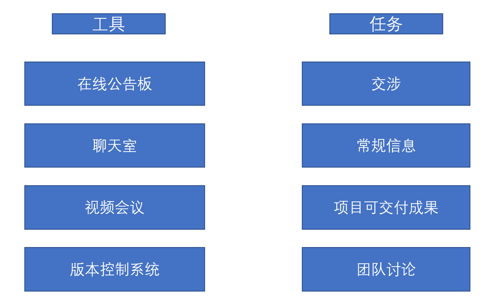
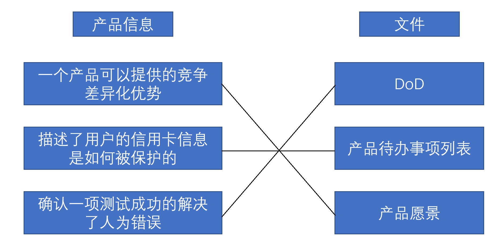
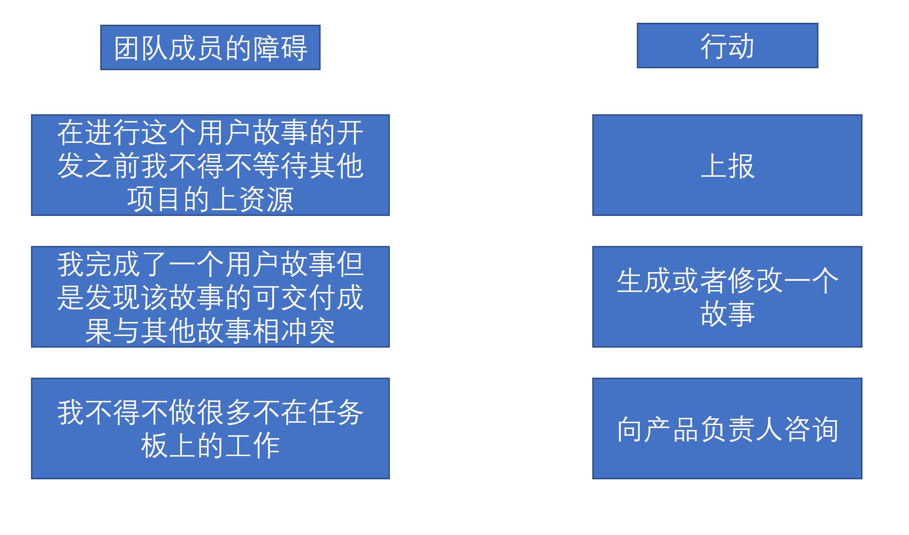
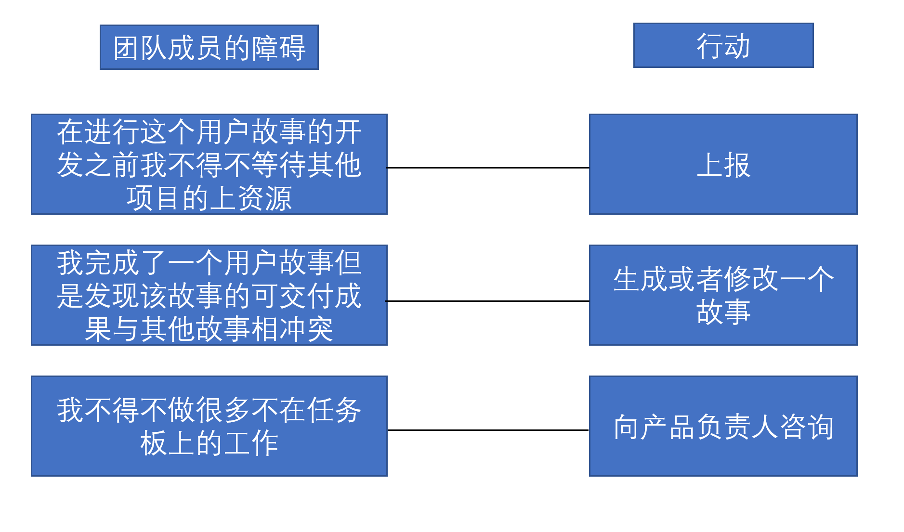
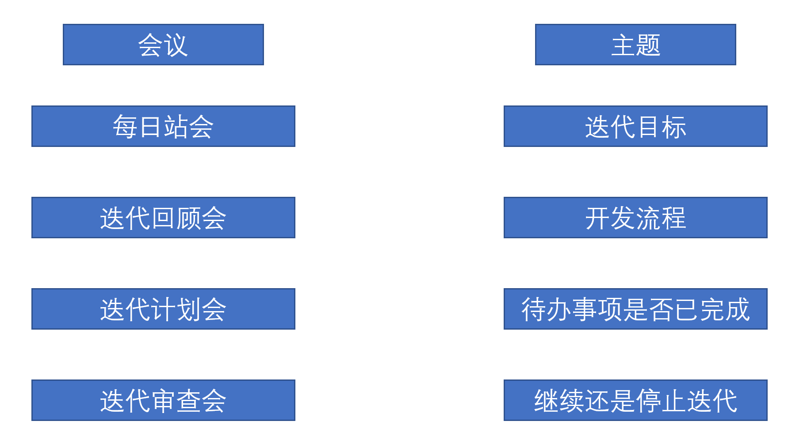
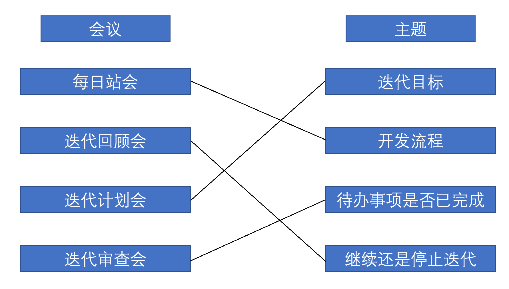

# 连线题

1. 一家医院正在为他们的一个内部关键系统运行一个项目，以管理帐单、病人数据和记录管理，以及咨询报告和医生的意见。项目经理现在需要对识别的风险进行分类。把左边的每个风险类型拖到右边的正确例子中。

   

   

      
Answer

      

   

2. 将左边的人际关系技能拖到右边的正确场景中。

   

   

      
Answer

      

   

3. 一个项目经理担心一个关键的利益相关者没有参与到项目中来，并得出结论，如果该利益相关者能更多地参与进来，最终的产品就不会那么好。把左边的情景拖到右边的正确的风险应对策略上。

   

   

      
Answer

      

   

4. 将左边的组织特征拖到右边的正确情景中。

   

   

      
Answer

      

   

5. 将左边的特征拖到右边正确的塔克曼阶梯上。

   

   

      
Answer

      

   

6. 一个新的敏捷项目的项目经理正在与一个成熟的团队一起审查一些角色，以避免对预期的混淆。把左边的描述拖到右边的角色上。

   

   

      
Answer

      

   

7. 一个敏捷团队在地理上被分隔在多个大洲，项目经理正在确定管理虚拟团队之间沟通的工具。把左边的适当工具拖到右边的每个项目任务上。

   

   

      
Answer

      

   

8. 根据一个新的产品开发流程，市场部将开始把业务和用户需求直接加入到敏捷项目文件中。把左边的产品信息拖到右边的正确文件中。

   

   

      
Answer

      

   

9. 团队在日常工作会议上报告了以下障碍。把左边的每个障碍拖到右边的项目经理需要采取的行动上。

   

   

      
Answer

      

   

10. 将左边的沟通事件拖到右边的事件中讨论的主要议题。

    

    

       
Answer

       

    

